**Taught by:** Jerrell Tate

### Topic A: Storage in the AWS Cloud

#### AWS Storage Services

1.  **Amazon S3** -- Highly scalable and durable object storage. Multiple copies stored across different physical locations.
2.  **Amazon EBS** -- Persistent block-level storage volumes
3.  **Amazon EFS** -- Scalable, elastic file system
4.  **Amazon S3 Glacier** -- Low-cost, long-term data archiving and backups

#### Amazon S3 Storage Classes

- **S3 Standard** -- Default for frequently accessed data requiring low latency
- **S3 Standard-IA** -- Lower cost for infrequently accessed data
- **S3 One Zone-IA** -- Lower-cost option with reduced durability (single AZ)
- **S3 Glacier Instant Retrieval** -- Archive with instant access
- **S3 Glacier Flexible Retrieval** -- Archive with flexible retrieval times
- **S3 Glacier Deep Archive** -- Lowest-cost storage, retrieval can take up to **12 hours** (exam question!)
- **S3 Intelligent-Tiering** -- Automatically moves data between tiers based on usage

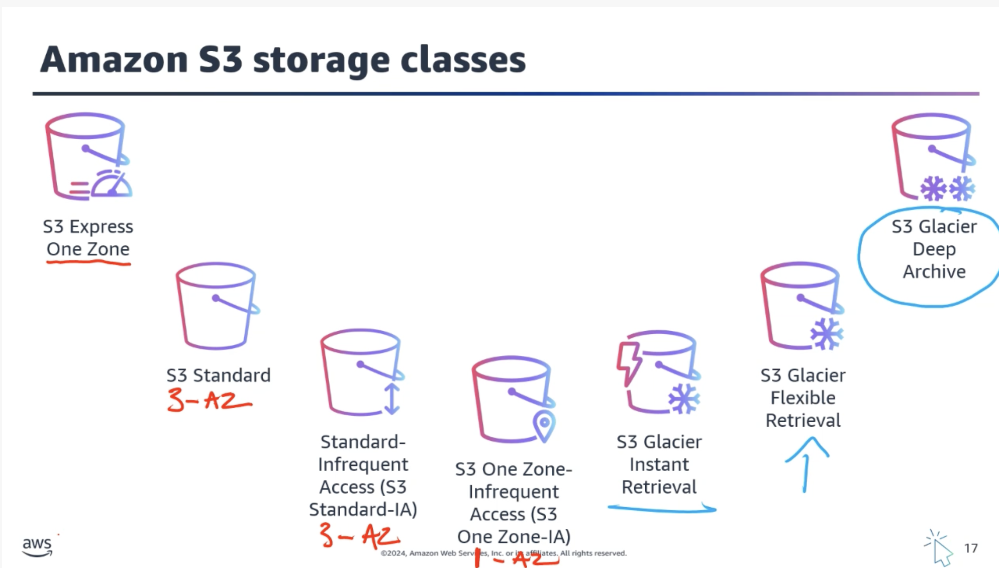

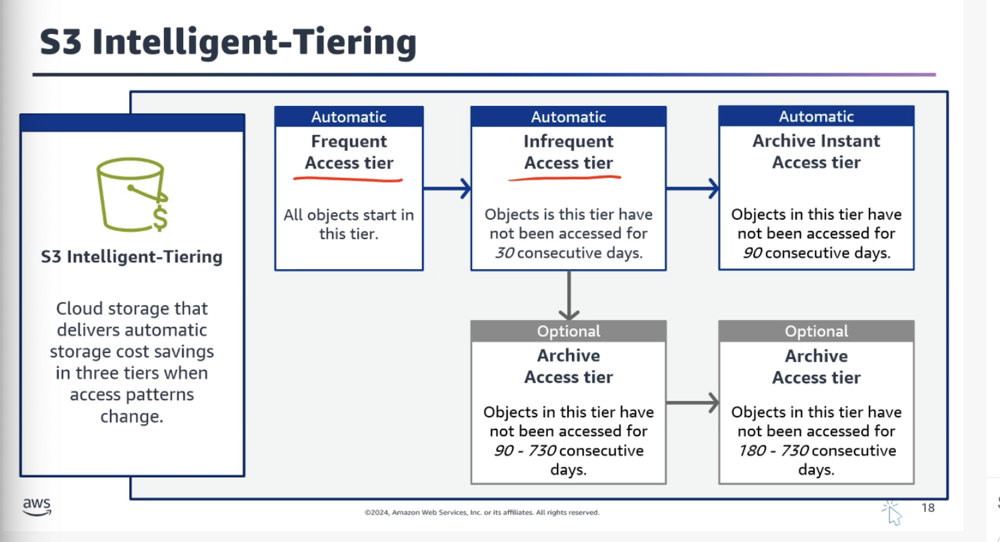

#### Object Storage Explained

In object storage, each object consists of:

- **Data** -- The actual file (image, video, document, etc.)
- **Metadata** -- Contextual information about the data
- **Key** -- Unique identifier

**Important:** When you modify a file in block storage, only the pieces that change are updated. When a file in object storage is modified, the **entire object is updated**.

#### Storage Type Comparison

- **Object storage (Amazon S3)** -- Scalable storage for unstructured data accessed via APIs. Ideal for backups, media, and static content.
- **Block storage (Amazon EBS)** -- High-performance storage attached to a single EC2 instance. Suited for OS disks and databases. **Zonal service**.
- **File storage (Amazon EFS)** -- Shared, scalable file system that multiple EC2 instances can access simultaneously. **Regional service**.

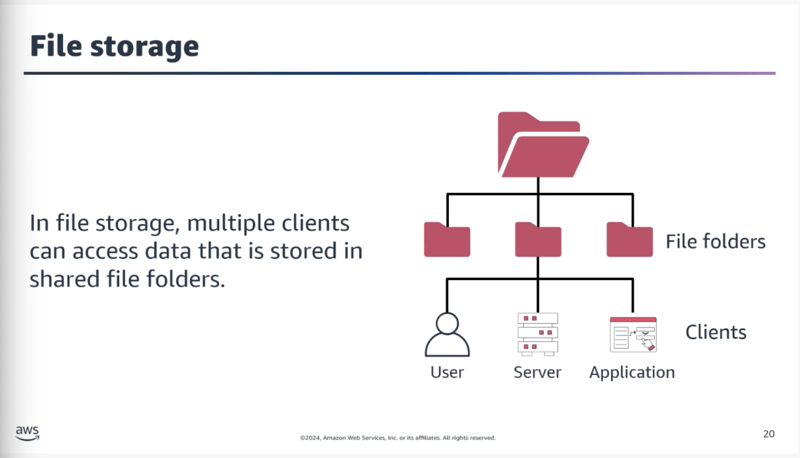

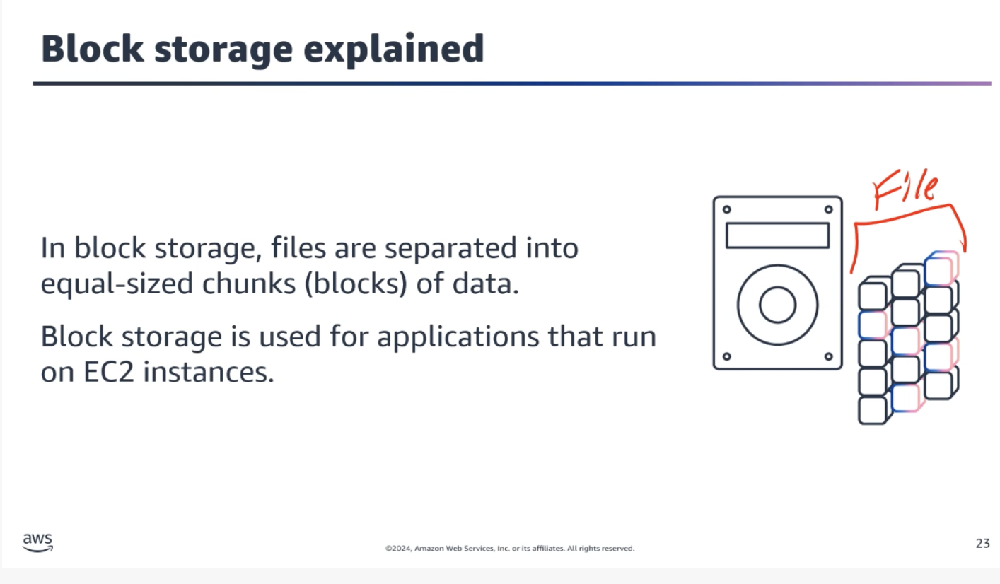

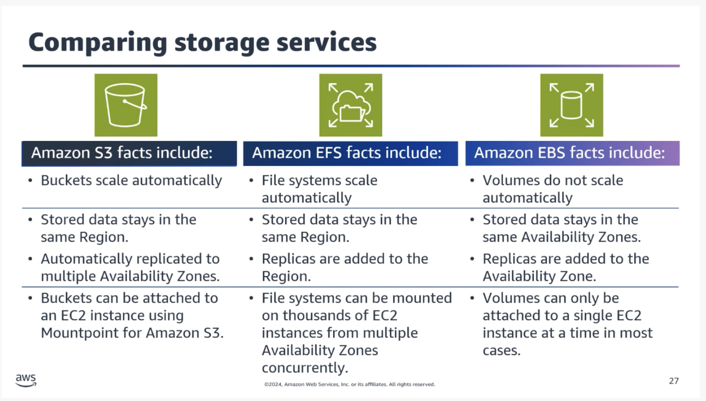

**Instance Store:**

Provides temporary block-level storage for an EC2 instance. All data is lost when the instance is stopped or terminated. Best for short-term, non-persistent data.

### Topic B: Databases in the AWS Cloud

#### Amazon RDS

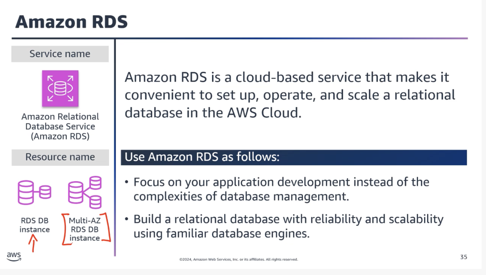

A fully managed relational database service that simplifies database setup, operation, scaling, backups, patching, and failover. Supports multiple database engines:

- Amazon Aurora
- MySQL
- PostgreSQL
- MariaDB
- Oracle
- SQL Server
- IBM DB2

**Amazon Aurora:**

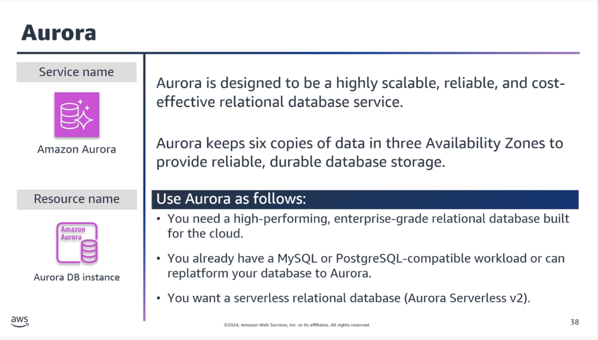

Designed for high availability and durability. Automatically replicates data across multiple Availability Zones. When you create an Aurora database, Aurora manages the underlying infrastructure -- software updates, backups, and failover.

**Common Question: Is Aurora part of RDS?**

Aurora is part of RDS, but it operates differently. There are different calls within the RDS API: Aurora deals with clusters, while the rest of the engines work in terms of instances. They're all part of RDS, but Aurora behaves differently, so it's common to think of Aurora as its own thing.

#### Relational vs Nonrelational Databases

**Nonrelational Databases (NoSQL):**

Use structures other than rows and columns. A common approach is key-value pairs -- data is organized into items (keys), and items have attributes (values).

In a key-value database, you can add or remove attributes from items at any time. Not every item needs to have the same attributes.

**Amazon DynamoDB:**

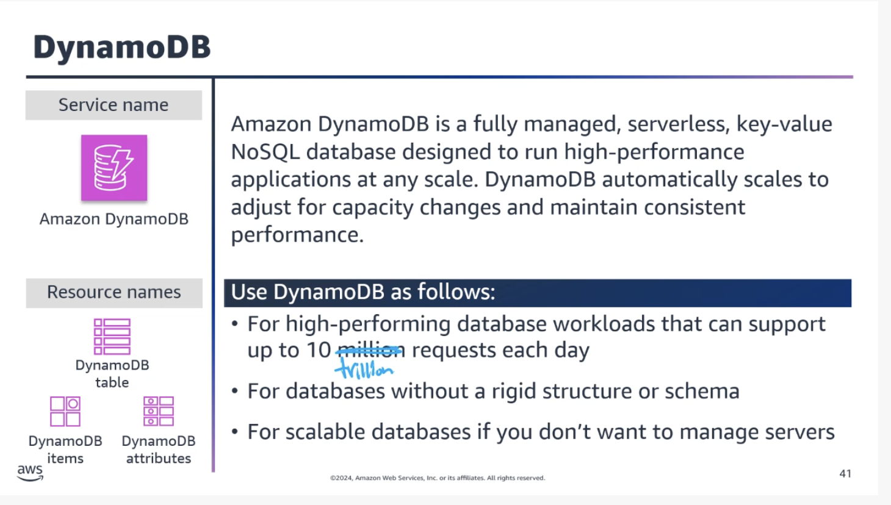

Suitable for applications with unpredictable or highly variable workloads where you need to handle sudden spikes in traffic or data volume.

#### Other Database Types

**In-memory databases:**

Store data entirely in RAM for extremely fast access. Well-suited for real-time analytics, caching, and gaming.

- **Amazon MemoryDB** -- Suitable for content caching, session management, and real-time applications

**Graph databases:**

Store and manage data as a network of interconnected entities.

- **Amazon Neptune** -- Suitable for social networks, recommendation engines, and knowledge graphs

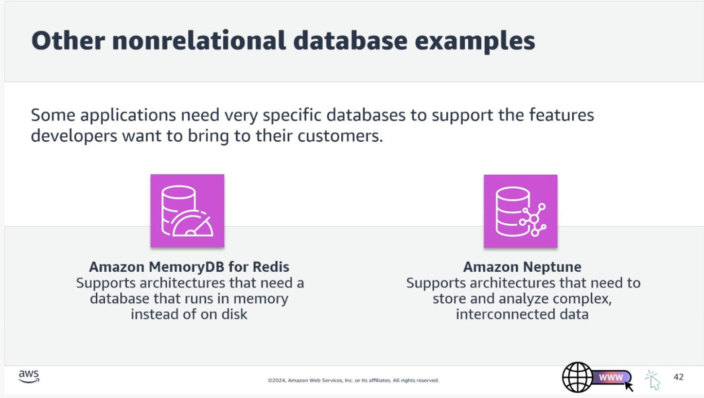

### Topic C: Data Analytics in the AWS Cloud

**Data Analysis** -- The process of examining and interpreting data to uncover insights and patterns.

**Data Analytics** -- The systematic use of data and statistical techniques to derive meaningful insights and make predictions.

Together, they make up **Business Intelligence (BI)**.

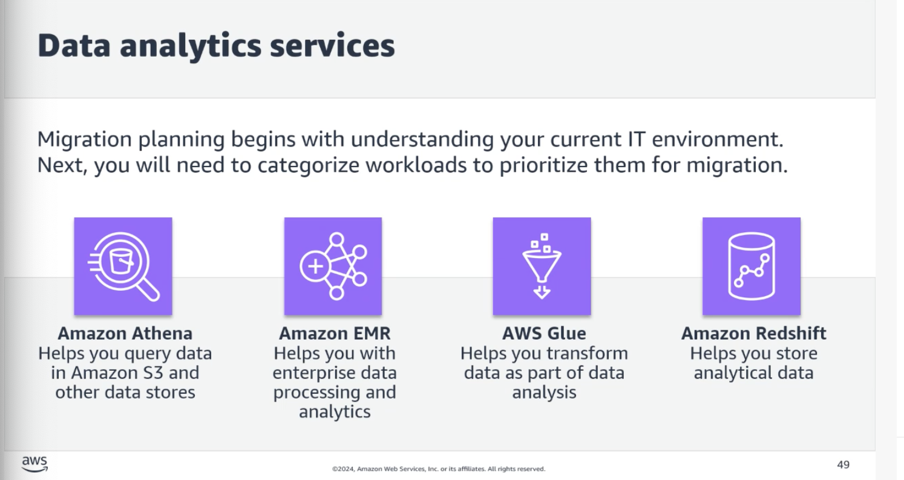

#### Analytics Services

1.  **Amazon Athena** -- Serverless query service to analyze data in S3 using standard SQL. Great for one-time queries.
2.  **Amazon EMR** -- Managed cluster service for big data frameworks (Apache Spark, Hive, Presto)
3.  **AWS Glue** -- Fully managed ETL (extract, transform, load) service
4.  **Amazon Redshift** -- Fast, fully managed data warehousing service. Amazon Redshift Spectrum can query data directly from S3.

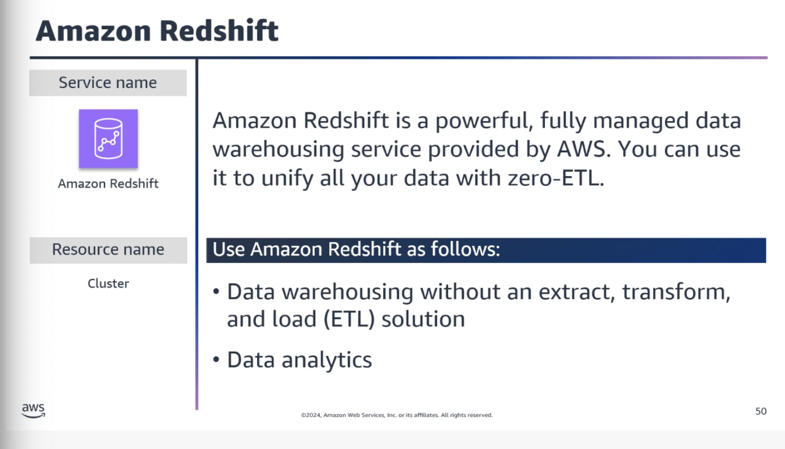

#### Real-Time Streaming Services

- **Amazon Kinesis** -- Collect, process, and analyze real-time streaming data
- **Amazon MSK** -- Managed Streaming for Apache Kafka. Build real-time data pipelines.
- **Amazon QuickSight** -- Cloud-powered BI service for data visualization and sharing

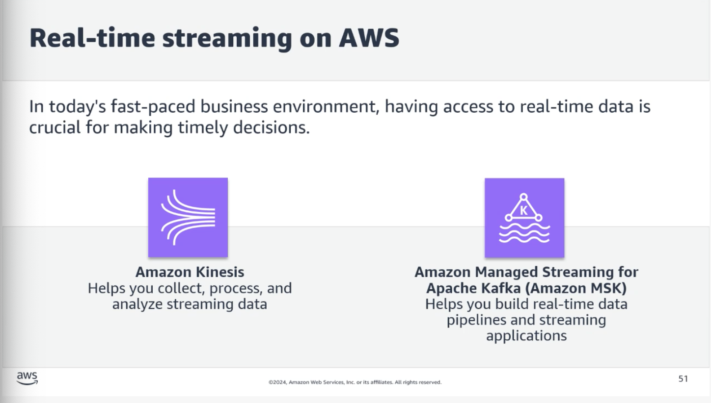

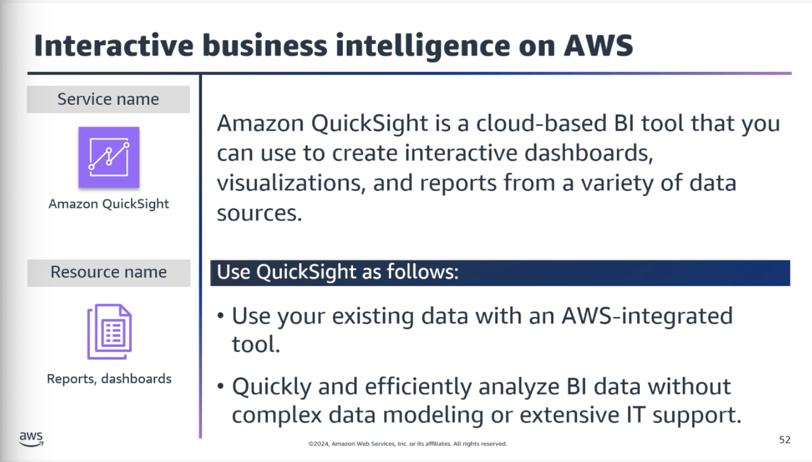

### Topic D: Artificial Intelligence on AWS

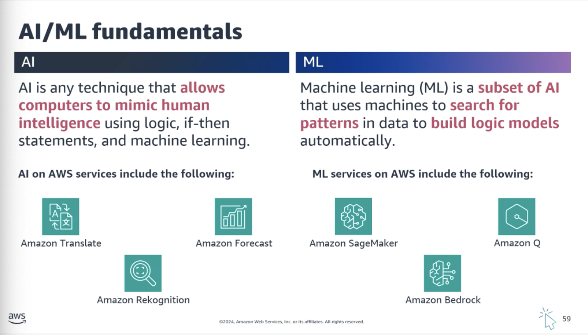

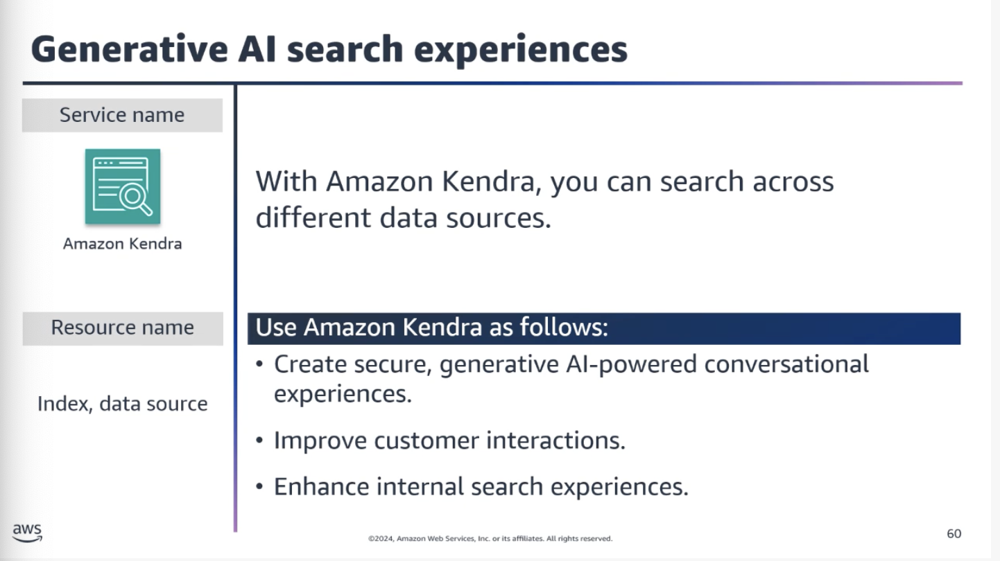

#### Text-Based AI Tools

1.  **Amazon Transcribe** -- Converts audio recordings into written text
2.  **Amazon Polly** -- Transforms text into natural-sounding speech
3.  **Amazon Textract** -- Extracts text and data from documents
4.  **Amazon Translate** -- Machine translation between languages
5.  **Amazon Lex** -- Build conversational interfaces (chatbots, voice assistants)
6.  **Amazon Kendra** -- Powerful search engine for finding information within company data

#### Machine Learning Services

1.  **Amazon SageMaker** -- Fully managed service to build, train, and deploy ML models
2.  **Amazon Bedrock** -- Pre-trained Foundation Models for building AI applications
3.  **Amazon Comprehend** -- Uses NLP to extract insights from documents (sentiment, topics, entities)
4.  **Amazon Q** -- Generative AI assistant designed for enterprise work

### Topic E: Migration to AWS

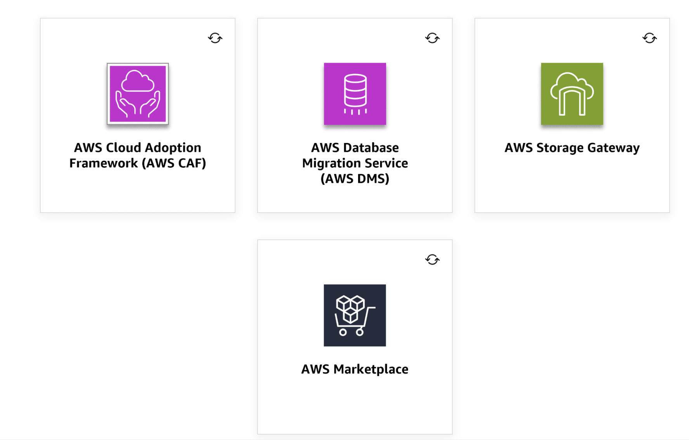

#### Migration Tools

1.  **AWS Cloud Adoption Framework (CAF)** -- Resource to guide your migration
2.  **AWS Database Migration Service (DMS)** -- Migrate databases with minimal downtime
3.  **AWS Storage Gateway** -- Seamlessly integrate on-premises storage with AWS for backups and archiving
4.  **AWS Marketplace** -- For licensing strategies (BYOL and AWS options)

**Other migration tools to know:** AWS DataSync, AWS Transfer Family, AWS Storage Gateway

#### Migration Strategies

1.  **Rehost (lift and shift)** -- No changes to existing infrastructure. Easier when you have less time for migration planning.
2.  **Replatform** -- Make a few cloud optimizations without changing core architecture
3.  **Refactor (transform)** -- Re-architect using cloud-native features
4.  **Retire** -- Decommission applications no longer needed

------------------------------------------------------------------------
