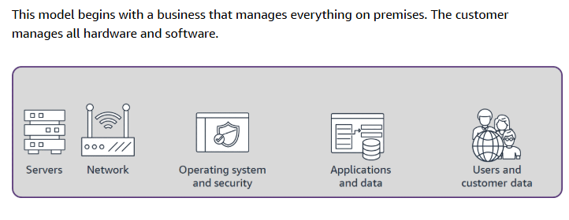
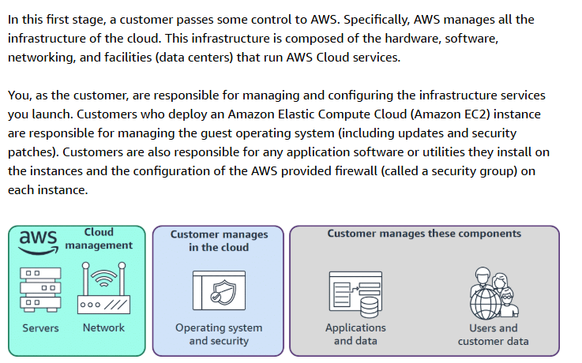
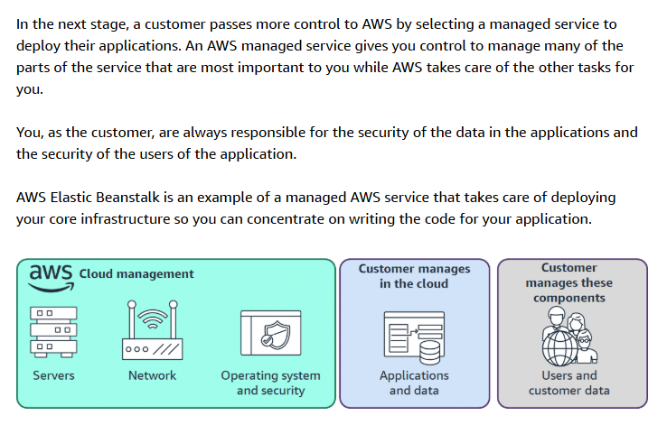
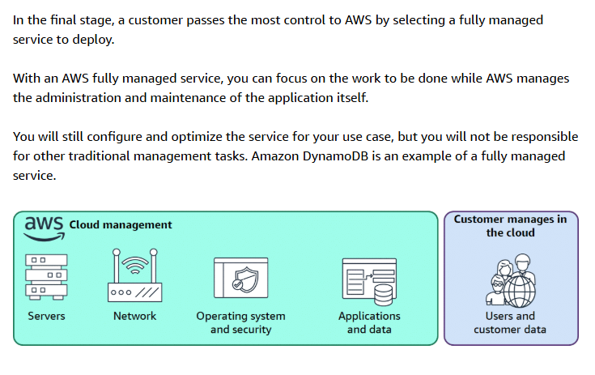
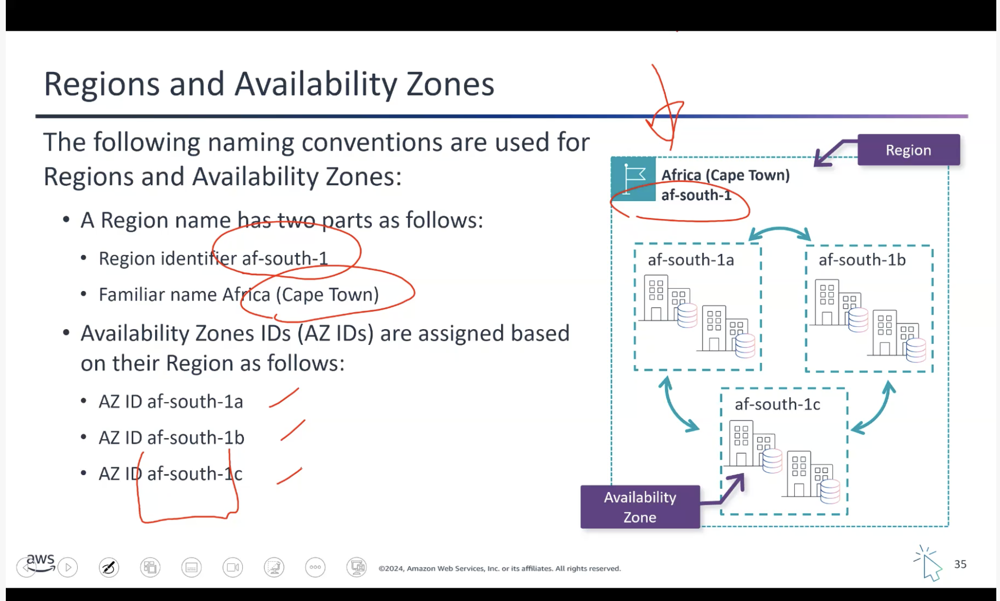
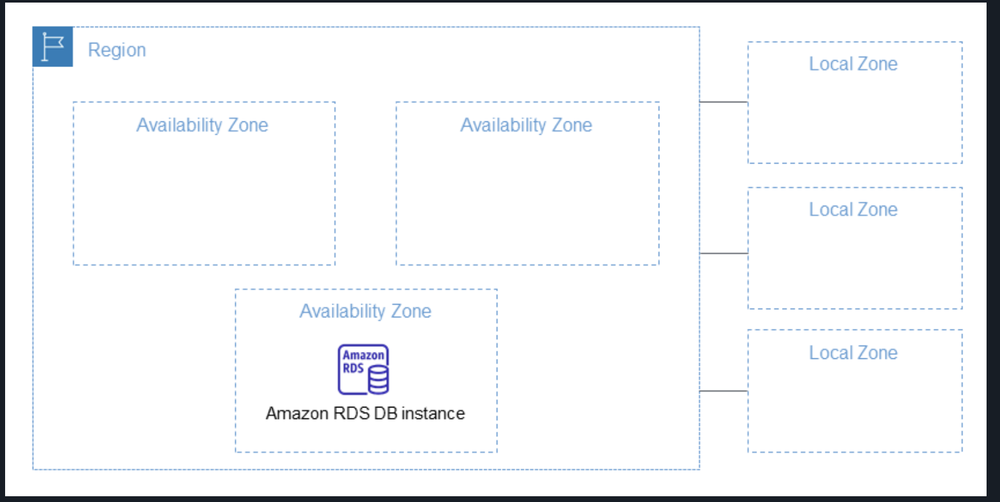
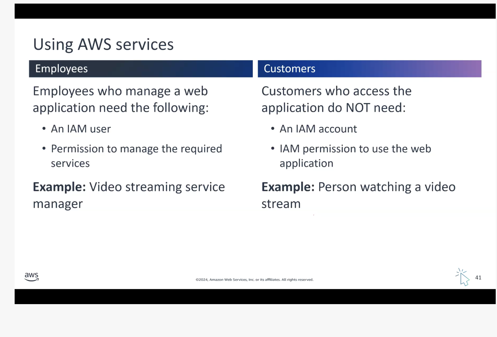
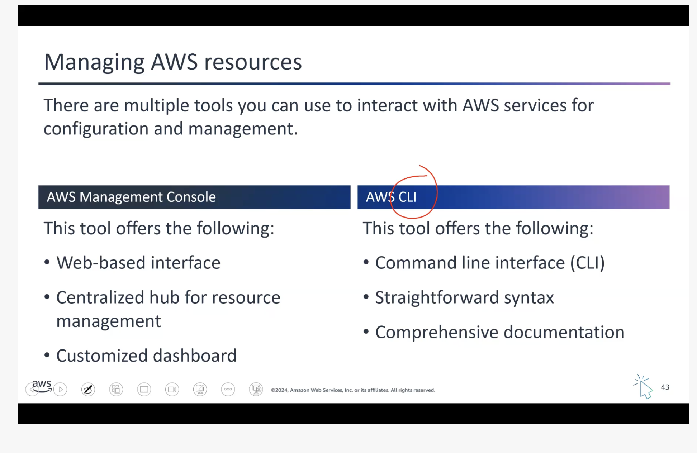
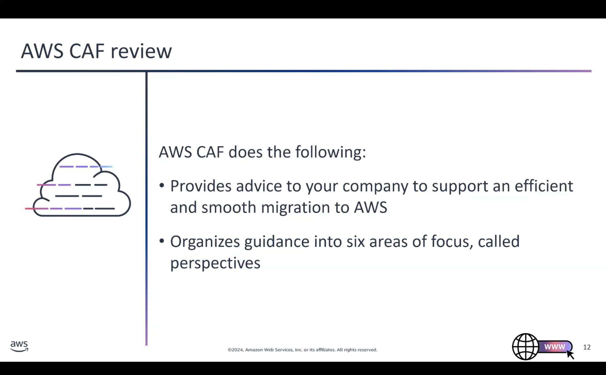

This page contains my notes from the AWS Cloud Practitioner course -- a four-part series that covers everything from cloud basics to advanced services. I took this course at AWS Skills Centers and wanted to document what I learned.

------------------------------------------------------------------------

## Course Resources

- **Course Links:** [AWS Skills Centers](https://qrco.de/bfGfyd) \| [Skillbuilder](https://skillbuilder.aws/)
- **Dashboard:** [Evantage Dashboard](https://evantage.gilmoreglobal.com/home/dashboard)
- **Materials:** AWS Student Guide (VitalSource Bookshelf) and Digital Course Supplement

------------------------------------------------------------------------

**Taught by:** Bill Albert

### Topic A: Understanding the AWS Cloud

AWS started in 2006 with just 1 service -- Amazon Simple Queue Service (Amazon SQS) -- to support Amazon's retail corporate needs. Amazon made all services accessible via APIs, and the rest is history.

**Cloud** refers to applications and services accessed over the Internet.

#### Six Advantages of Cloud Computing (IMPORTANT)

1.  **Trade fixed expense for variable expense** -- Instead of investing heavily in data centers and servers before you know how you're going to use them, in the cloud, you only pay for the services you consume.
2.  **Benefit from massive economies of scale** -- Since usage from hundreds of thousands of customers is aggregated in the cloud, providers like AWS can achieve higher economies of scale, which translates into lower pay-as-you-go prices.
3.  **Stop guessing about capacity needs** -- Have the flexibility to grow capacity when required.
4.  **Increase speed and agility** -- You can reduce the time to make resources available to your developers from weeks to minutes, encouraging innovation.
5.  **Stop spending money running and maintaining hardware** -- Focus on your business, not infrastructure.
6.  **Go global in minutes** -- Deploy worldwide with a few clicks.

#### AWS Pricing Model

AWS uses a pay-as-you-go pricing model. Use the [AWS Pricing Calculator](https://calculator.aws) to estimate costs.

**Pricing depends on:**

1.  Services you use
2.  How much you use
3.  AWS region -- prices change depending on the region

#### Computing Deployment Models

1.  **On-premises deployment** -- YOU do it all -- you own everything, manage everything, and scale everything from hardware
2.  **Cloud-based deployment** -- You pass all hardware responsibility to the cloud
3.  **Hybrid deployment model** -- Combination of on-premises and cloud

#### Advantages of Automation in the Cloud

1.  Improved consistency and reliability
2.  Enhanced security posture
3.  Agile and responsive environments

#### Shared Infrastructure Models

Making a decision to move some business operations to the cloud is not a small decision. Many companies will choose to do this slowly over time. With the shared infrastructure model, organizations can decide how much of the underlying system management, maintenance, and overhead they want to pass to a cloud service provider (CSP) and how much they want to maintain themselves.

**Four Models:**

1.  **Model 1: Business hosts everything** -- You manage everything from hardware to application

2.  **Model 2: Managed Servers (Amazon EC2)** -- AWS manages the physical infrastructure, you manage the rest

3.  **Model 3: Managed Services (AWS Elastic Beanstalk)** -- AWS handles more of the stack

4.  **Model 4: Fully Managed Services (Amazon DynamoDB)** -- AWS manages almost everything

### Topic B: AWS Global Infrastructure

#### Three Boundaries

- **Global boundary** → AWS Cloud -- Services running in the cloud are isolated from interruptions in the outside world
- **Regional boundary** → Region -- Each region consists of multiple availability zones (which are independent and physically/geographically separated)
- **Zonal boundary** → Availability Zone

#### Choosing an AWS Region (IMPORTANT)

Four factors to consider:

1.  **Compliance with data governance and legal requirements** -- Depending on your company and location, you might need to run your data in specific areas. For example, if your company requires all its data to reside within the UK, you'd choose the Europe (London) Region.
2.  **Proximity to your customers** -- Selecting a Region close to your customers helps get content to them faster. If your company is in Washington DC but customers are in Singapore, you might run apps in the Asia Pacific (Singapore) Region.
3.  **Available services within a Region** -- Not all services are available in every region. AWS builds out physical hardware one Region at a time, so newer services like Amazon Braket might not be available everywhere yet.
4.  **Pricing** -- Costs can vary significantly by region. Running a workload in São Paulo might cost 50% more than running the same workload in Oregon due to tax structures.

#### Availability Zones Explained

Regions are made up of multiple Availability Zones. An Availability Zone is made of one or more data centers and can be spread over multiple buildings and sites. Every AZ in a Region is in a separate failure domain from the others (different substations, fiber circuits, etc). AZs are "local" but not close by, and separate infrastructure ensures failure of one doesn't impact any others. AZs interconnect with high-speed fiber.

Here's an example:

- `us-east-1a` is one AZ
- Even if AWS internally uses multiple buildings for that AZ, they are treated as one failure domain
- If `us-east-1a` has a failure, your workload in that AZ is affected

I can choose to place my resources in all three AZs `us-east-1a`, `us-east-1b`, and `us-east-1c` to improve my RESILIENCY. If 1a goes down, I can still count on AZs 1b and 1c to serve my application to end users.

**Reference:** [AWS Global Services Whitepaper](https://docs.aws.amazon.com/whitepapers/latest/aws-fault-isolation-boundaries/global-services.html)

#### Local Zones (IMPORTANT)

AWS Local Zones extend an AWS Region by placing compute, storage, and database resources closer to end users in specific locations, enabling ultra-low latency deployments. They allow services such as Amazon RDS to run in multiple locations without automatic cross-Region replication unless explicitly configured.

Local Zones are ideal for latency-sensitive applications like:

- Real-time gaming
- Media production
- Financial services

**Reference:** [AWS Local Zones Documentation](https://docs.aws.amazon.com/AmazonRDS/latest/UserGuide/Concepts.RegionsAndAvailabilityZones.html)

### Topic C: Connecting to the AWS Cloud

#### IAM Policy Management

**Attaching Policy to an IAM User Group:**

A Policy Statement requires three components (EAR):

- **Effect:** "Allow" or "Deny"
- **Action:** Specific actions permitted/denied
- **Resource:** Resources the policy applies to

**Key Rules:**

- A group can have multiple users
- A user can belong to multiple groups
- For a user to perform an action:
  1.  There must be at least one policy that says ALLOW
  2.  There must be no policy that says DENY -- One DENY negates infinite ALLOWs

**Reference:** [AWS IAM Access Policies](https://docs.aws.amazon.com/IAM/latest/UserGuide/access_policies.html)

### Topic D: Building a Static Website

**Without SSL Certificate:**

1.  Create S3 bucket + block all public access to the bucket (for testing)
2.  Upload files to bucket
3.  Enable static hosting for S3 bucket
4.  Visit the bucket link -- forbidden access to bucket
5.  Unblock all public access to the bucket
6.  Visit the bucket link -- publicly accessible now -- website visible

**With SSL Certificate:**

CloudFront is the way to do it -- S3 cannot handle SSL directly. You need to upload your certificate to the Certificate Manager, then apply it as a custom cert. Then add the CNAME from Route 53 to CloudFront.

### Topic E: AWS Frameworks

#### AWS Well-Architected Framework

The AWS Well-Architected Framework provides guiding principles and best practices for building secure, reliable, efficient, and cost-effective cloud architectures. It helps organizations evaluate, improve, and optimize their cloud systems while reducing risk and maximizing cloud benefits.

**Six Pillars:**

1.  Operational Excellence
2.  Security
3.  Reliability
4.  Performance Efficiency
5.  Cost Optimization
6.  Sustainability

#### AWS Cloud Adoption Framework (CAF)

Cloud migration is a gradual, expertise-driven process that requires careful planning and coordination across an organization. The AWS CAF helps organizations assess readiness, identify gaps, and create a clear roadmap aligned with business goals.

**Six Perspectives:**

- **Business:** Business, People, Governance
- **Technical:** Platform, Security, Operations

------------------------------------------------------------------------
