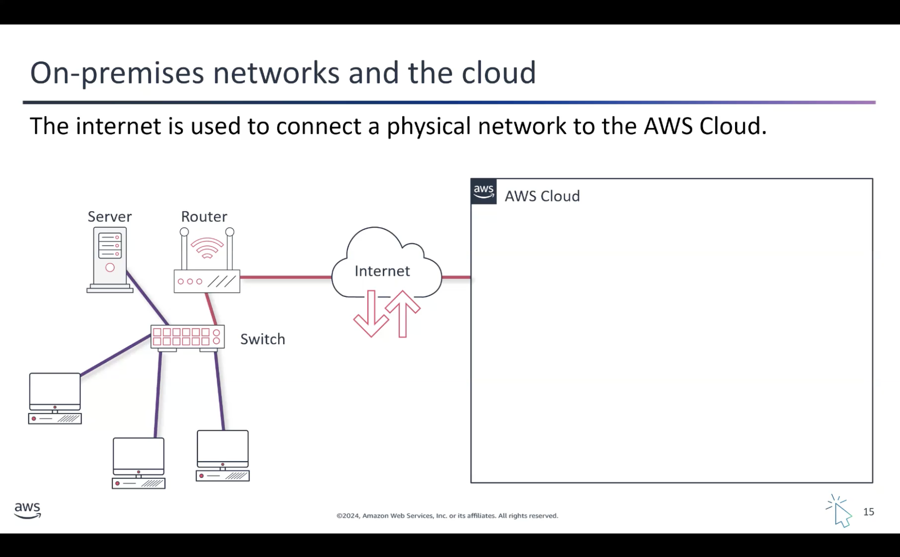
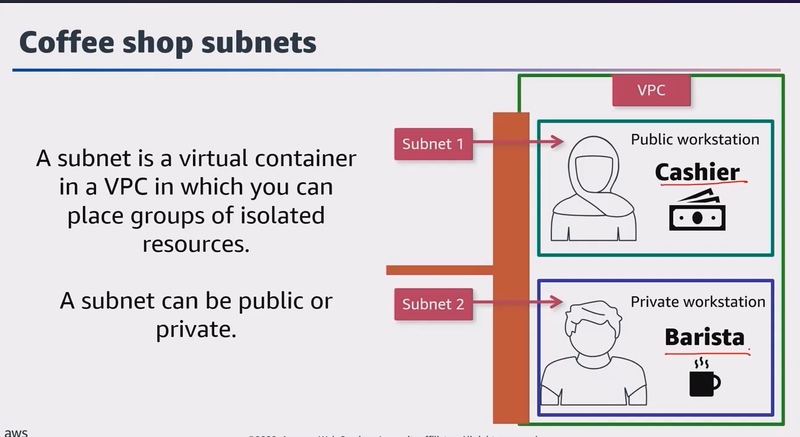
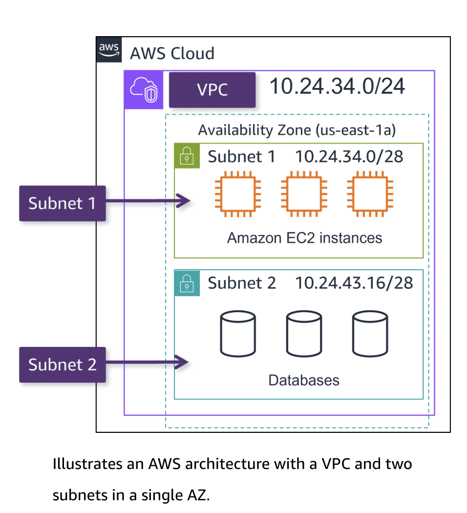
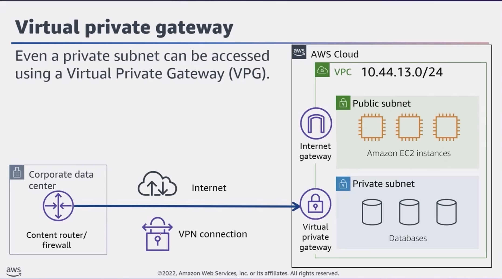
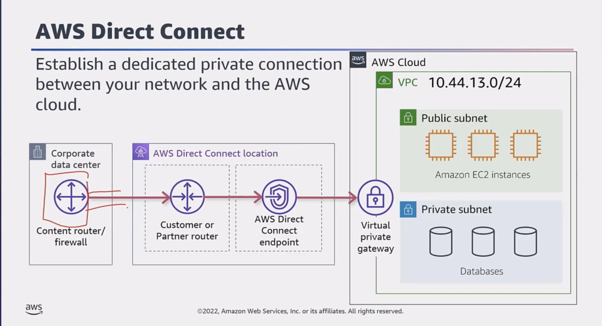
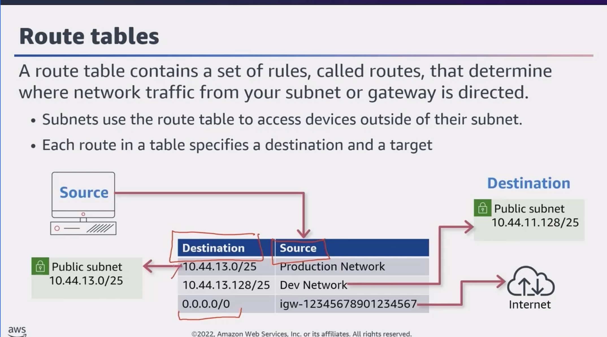

**Taught by:** Bill Albert

### Topic A: Networking in the AWS Cloud

#### Amazon VPC (Virtual Private Cloud)

Amazon VPC is a private, isolated section of the AWS Cloud that you can customize and control. It's like having your own private network in the larger AWS infrastructure.

### Topic B: Amazon VPC Networking Components

#### Connecting Your VPC to the Internet

1.  **Internet Gateway** -- To allow public traffic from the internet to access your VPC, you attach an internet gateway to the VPC.

2.  **Virtual Private Gateway (VPG)** -- For more secure and reliable access, you can connect to your VPC using a private network, such as an existing corporate network or a VPN connection. A virtual private gateway allows traffic into the VPC only if it's coming from an approved network.

3.  **AWS Direct Connect** -- Establishes a dedicated private network connection (NOT the public internet) between your on-premises infrastructure and your VPC. This provides a more reliable, lower-latency, and potentially more secure way to access your VPC resources.

    The Customer or Partner router is provided by the company's ISP -- which is connected to special hardware that is an AWS Direct Connect endpoint.

**Direct Connect Summary:**

With AWS Direct Connect, you create a private, dedicated network connection between your own infrastructure and the AWS Cloud. This is different from using the public internet to access AWS services.

Main benefits:

- Improved performance
- Enhanced security
- More consistent and predictable network experience

**Important AWS Direct Connect Billing Info:**

- **Capacity** (measured in MBps/GBps)
- **Port hours** (measured in time that a port is active)
- **Data transfer out (DTO)** (charged per GiB)

#### VPN Connection Types

- **Site-to-Site VPN** -- Acts as an internal private network for companies with multiple geographically separated locations
- **AWS Client VPN** -- Fully managed remote access VPN solution that employees can use to securely access resources in both AWS and on-premises business networks
- **AWS VPN CloudHub** -- Uses a hub-and-spoke model where multiple Customer Gateways connect to one VPG

#### Amazon VPC Traffic Control

**Route Tables:**

A route table is like a map that tells your cloud-based resources how to find their way around your virtual network. Just like a regular map, a route table has routes that define where traffic should be directed.

**Virtual Firewalls:**

Virtual firewalls are the security guards of your virtual network. Two main types:

1.  **Network ACLs** -- Like the outer walls of your virtual network, determining which types of traffic are allowed to enter or leave your overall setup
2.  **Security Groups** -- Act as the inner security guards, controlling access to individual cloud resources

#### Network ACL (NACL)

A network access control list (ACL) is a virtual firewall that controls inbound and outbound traffic at the subnet level.

**Stateless Packet Filtering:**

An ACL is stateless -- it filters BOTH INBOUND AND OUTBOUND traffic. For a request packet that may have been ALLOWED into the network, while a response packet is being sent out, the ACL DOES NOT remember if it was allowed in. It refers to the outbound rules and only allows the response to leave if it's explicitly ALLOWED.

**Notes:**

1.  **Default ACL** -- All AWS accounts come with a default network ACL that ALLOWS ALL INBOUND AND OUTBOUND TRAFFIC
2.  **Custom ACL** -- By default, all inbound and outbound traffic is DENIED
3.  ALL network ACLs have an **EXPLICIT DENY** rule -- if a packet doesn't match any other rules, it's denied

#### Security Groups

Similar to an ACL, but for a resource (usually EC2 instances) -- ONLY CHECKS FOR INBOUND TRAFFIC BY DEFAULT.

- By default: OUTBOUND TRAFFIC IS ALLOWED, INBOUND TRAFFIC IS DENIED
- Security groups allow **stateful** connections

**Stateful Packet Filtering:**

If a request is allowed in one direction (inbound or outbound), the response is automatically allowed without being filtered by the security group again.

**Reference:** [Default Security Groups](https://docs.aws.amazon.com/vpc/latest/userguide/default-security-group.html) \| [Network ACLs](https://docs.aws.amazon.com/vpc/latest/userguide/vpc-network-acls.html#default-network-acl)

### Topic C: Compute in the AWS Cloud

#### Amazon Machine Image (AMI)

An AMI provides the information required to launch an instance. Includes:

1.  One or more Amazon EBS snapshots
2.  A template for the root volume (OS, application server, applications)
3.  Launch permissions that control which AWS accounts can use the AMI
4.  A block device mapping for volumes to attach at launch

#### Types of Storage Associated with EC2 Instances

1.  **Instance Store** -- Temporary/Ephemeral Storage -- When the instance is shut down, all data is removed -- **LIKE STORING DATA ON THE PHONE**
2.  **EBS Volume** -- Preserves data through instance stops and terminations. Supports full-volume encryption -- **LIKE STORING DATA ON A MEMORY CARD**
3.  **Amazon EFS** -- Scalable file storage for workloads running on multiple instances -- **LIKE STORING DATA IN THE CLOUD**

#### Container Services

- **ECS** -- Elastic Container Service
- **EKS** -- Elastic Kubernetes Service
- **Amazon ECR** -- Elastic Container Registry -- Managed Docker container registry
- **AWS Fargate** -- Serverless compute engine for containers

#### Serverless Services

Serverless services let you run applications in the cloud without managing servers or infrastructure, while the cloud provider automatically handles provisioning, scaling, and resource management.

**Benefits:**

1.  **Reduced operational overhead** -- Focus on building your application, not managing servers
2.  **Scalability** -- Automatically scales up or down based on demand
3.  **Cost optimization** -- Only pay for compute time and resources consumed
4.  **Efficient time to market** -- Deploy features quickly without worrying about infrastructure

#### AWS Lambda

Used to provision compute power to run a piece of code for a limited period of time, eliminating the need for dedicated EC2 instances where code might sit idle. Instead of setting up VMs or containers, you upload your code to Lambda. It automatically runs that code in response to events or triggers.

**Key Points:**

- Billing is metered in increments of one millisecond
- Lambda functions can run up to **15 minutes** per invocation (timeout can be set from 1 second to 15 minutes)
- Integrates with other AWS services via event-driven invocation or polling queues/streams

#### Edge Services

Edge computing processes data closer to where it's generated rather than in centralized cloud data centers. This approach:

1.  Reduces latency
2.  Improves reliability
3.  Lowers bandwidth usage
4.  Enhances security by keeping data local

AWS edge services like AWS Outposts, AWS Wavelength, and AWS IoT Greengrass enable running applications and processing data near the source.

------------------------------------------------------------------------
