**Taught by:** Bill Albert

### Topic A: Identities and Permissions

#### IAM Groups and Roles

1.  **IAM Group** -- Multiple IAM users in a group
    - Group membership is persistent
    - Group permissions always apply to all group members
    - Policies are attached to groups
2.  **IAM Role** -- An IAM user requests **temporary** permissions to **assume** a role to perform a certain task
    - Roles are assumed one at a time
    - Role permissions are applied for that session and replace existing permissions

**Common Managed Policies:**

1.  `AdministratorAccess` -- Grants full access to all AWS services and resources
2.  `AmazonEC2FullAccess` -- Allows full access to EC2 instances and related resources
3.  `AmazonS3ReadOnlyAccess` -- Provides read-only access to S3 buckets and objects

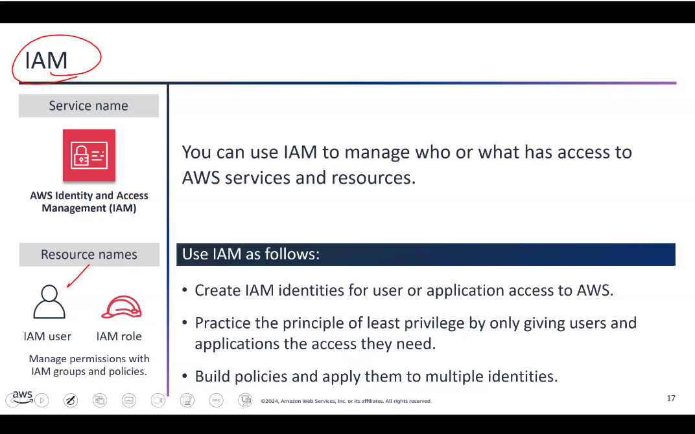

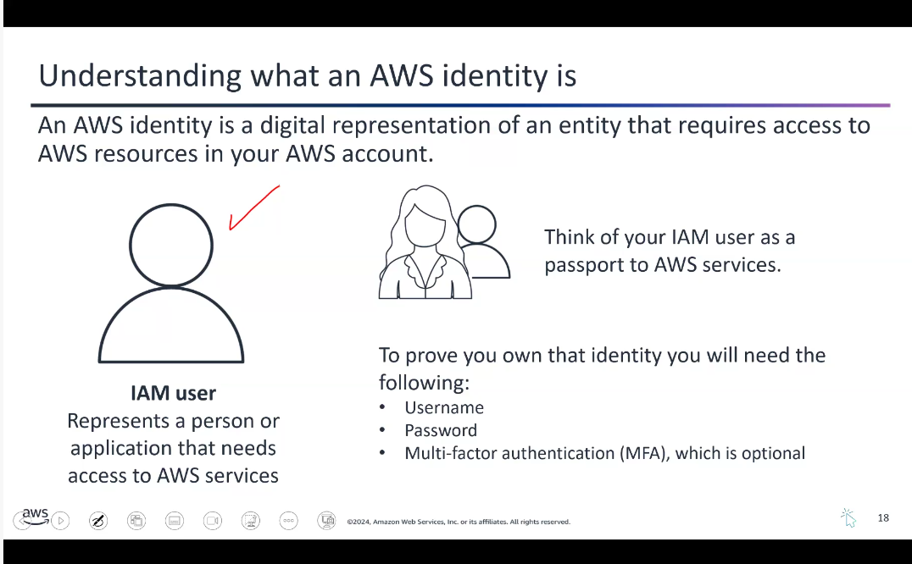

#### Additional AWS Security Services (IMPORTANT)

1.  **AWS IAM Identity Center** -- Centrally manage user identities and control their access to your AWS resources. Makes it efficient to onboard and provision users, groups, and roles.
2.  **AWS Key Management Service (KMS)** -- Helps you create and manage encryption keys. These keys are used to encrypt your data in AWS services or your own applications.
3.  **AWS Secrets Manager** -- Securely stores and manages your sensitive information like login credentials, API keys, or database connection details. Instead of hardcoding this data in your applications, store it in Secrets Manager.

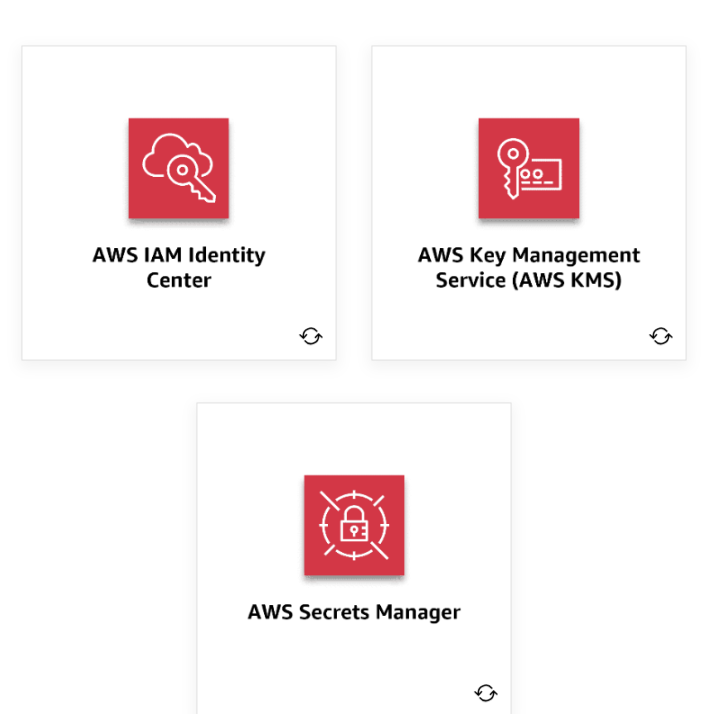

#### AWS Trusted Advisor (IMPORTANT)

AWS Trusted Advisor analyzes your use of AWS services and provides personalized recommendations to optimize performance, security, and cost-efficiency. It's like having an experienced cloud expert constantly reviewing your AWS workloads.

Provides recommendations in areas like:

- Cost optimization
- Security
- Fault tolerance
- Service limits

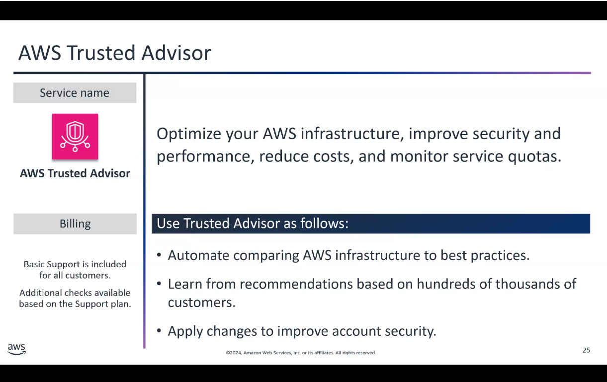

**Pro tip:** Inside the EC2 instance console, you can curl `http://169.254.169.254` (IP of the hypervisor) to get metadata about that particular EC2 instance.

### Topic B: Security, Governance, and Compliance

#### Shared Responsibility Model

AWS operates on a shared responsibility model:

- **AWS is responsible for:** Security OF the cloud (physical infrastructure, hardware, networking)
- **Customer is responsible for:** Security IN the cloud (data, applications, identity management, encryption)

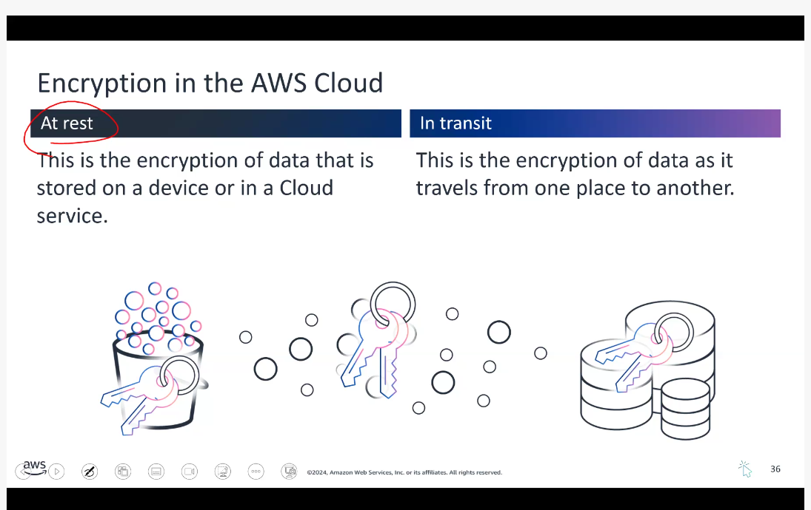

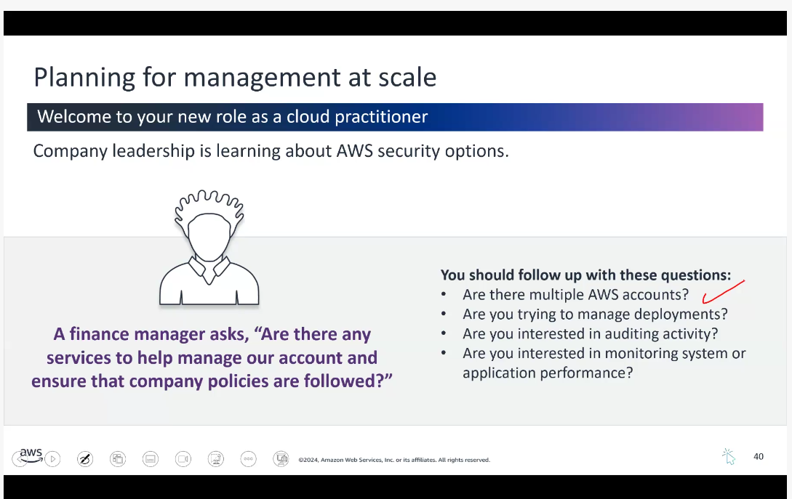

#### AWS Artifact

A **FREE** managed service. If your business operates in a regulated industry or needs to demonstrate compliance, AWS Artifact is a time-saver. Instead of searching for complex documents on your own, you can access them all in one central, secure location.

Includes: ISO, PCI, HIPAA agreements

The service automatically keeps these documents up to date as new versions are released.

#### Other Governance and Management Services

1.  **AWS Organizations** -- Centrally manage and control multiple AWS accounts. Enforce consistent policies across all your accounts.
2.  **AWS CloudFormation** -- Define your infrastructure as code. Create and manage AWS resources in a repeatable and automated way using templates.
3.  **AWS CloudTrail** -- Logging service that provides a detailed audit trail of all the actions taken in your AWS accounts.
4.  **Amazon CloudWatch** -- Monitoring and observability service that helps you track the performance and health of your AWS resources.

### Topic C: Monitoring and Maintaining the AWS Cloud

#### AWS CloudTrail

A logging service that captures all the API calls made to your AWS resources. You can identify exactly which actions are being performed on your cloud infrastructure, by whom, and when. It's crucial for audit and security purposes.

**Examples include:** Creating a new server, modifying a database, or logging in to the AWS Management Console.

#### Amazon CloudWatch

A visualization and monitoring tool -- a centralized way to monitor your cloud resources, including logs, metrics, and events. You can use CloudWatch to create custom dashboards, set alarms, and gain deeper insights into the overall health and performance of your AWS environment.

**Using CloudTrail and CloudWatch Together:**

- CloudTrail provides the **what and who** by capturing all the API activity
- CloudWatch provides the **how** by monitoring the real-world performance and behavior of your AWS resources

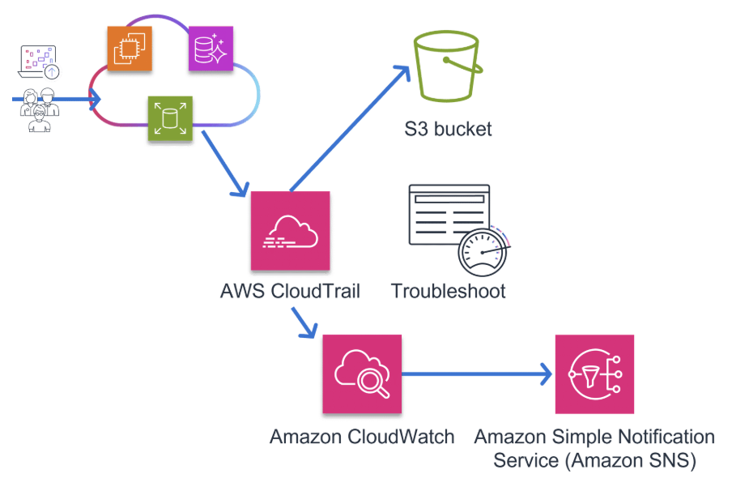

### Topic D: Reliability and Performance Efficiency

#### Key Terminology

- **Availability** -- The percentage of time that a workload is available for use. Deploying into multiple AZs or Regions makes it highly available.
- **Resiliency** -- The ability of a system to recover when stressed by load. Example: failover mechanisms.
- **Reliability** -- The ability of a system to perform its intended function correctly and consistently.
- **Scalability** -- The ability of a cloud service to grow as demands change over time.
- **Elasticity** -- The ability to acquire resources as you need them and release them when you don't. Example: AWS Lambda.
- **Durability** -- The ability to ensure long-term data stability. Amazon S3 is designed for 99.999999999% data durability.

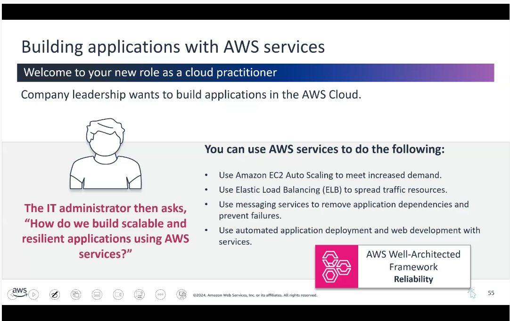

#### Scaling in AWS

- **Vertical Scaling** -- Teaching one barista to work faster (upgrading instance type)
- **Horizontal Scaling** -- Having more baristas (adding more instances)

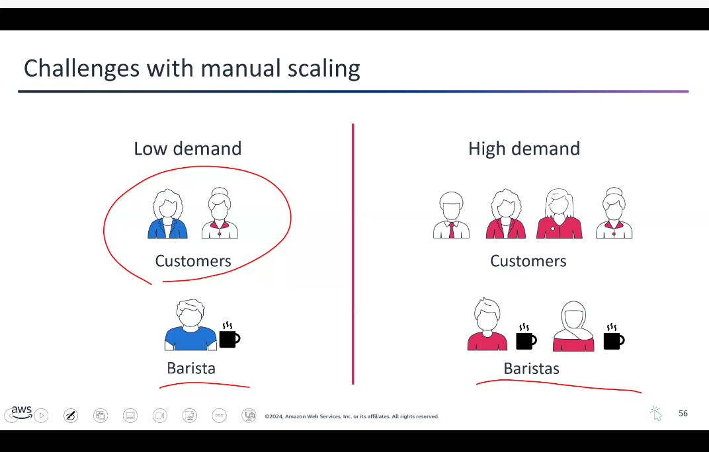

**Amazon EC2 Auto Scaling:**

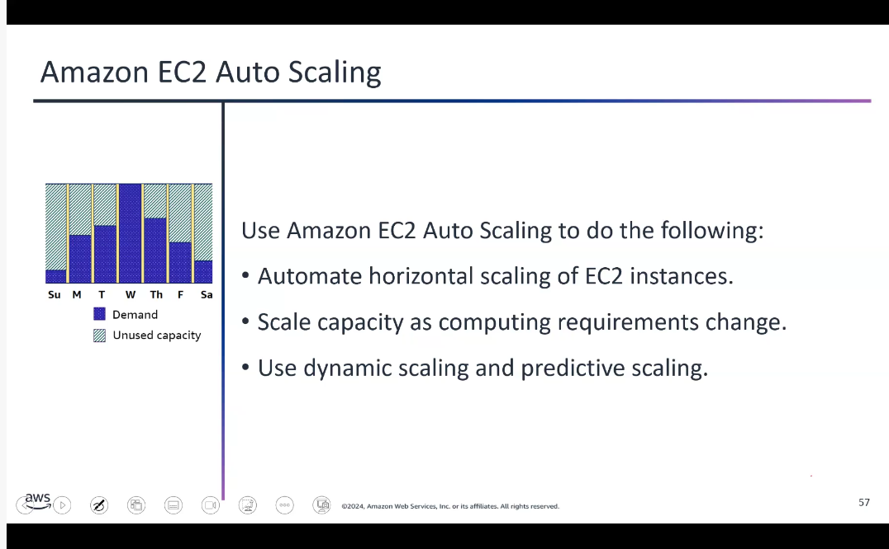

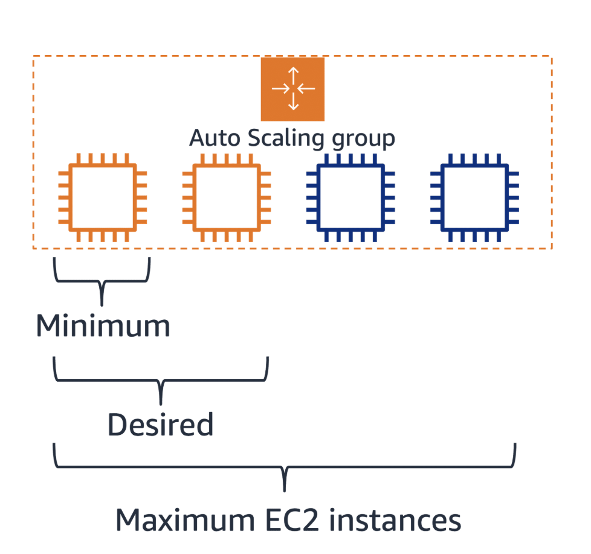

1.  **Dynamic scaling** -- Responds to changing demand
2.  **Predictive scaling** -- Automatically schedules instances based on predicted demand

#### Elastic Load Balancing

A load balancer serves as a single entry point for web traffic to an Auto Scaling group, distributing incoming requests across multiple EC2 instances.

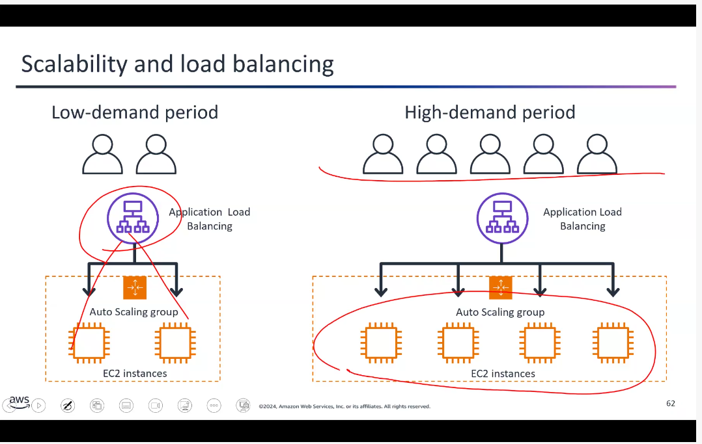

**Three Types:**

1.  **Application Load Balancer** -- Operates at Layer 7 (application layer). Routes based on content, uses round-robin or least-outstanding-requests algorithm.
2.  **Network Load Balancer** -- Operates at Layer 4. Handles millions of requests per second.
3.  **Gateway Load Balancer** -- Helps deploy, scale, and manage third-party virtual appliances.

#### Notifications and Messaging Services

1.  **Amazon SQS** -- Decouples application components for independent scaling and reliable message delivery
2.  **Amazon SNS** -- Publish-subscribe messaging to send notifications to multiple subscribers
3.  **Amazon SES** -- Secure, cost-effective email service for transactional and marketing emails
4.  **Amazon EventBridge** -- Centralized event bus that simplifies integrating applications with AWS and external data sources

#### Quick Deployment Services

1.  **AWS CloudFormation** -- Powerful but steep learning curve. Infrastructure as code.
2.  **AWS Elastic Beanstalk** -- User-friendly way to deploy and scale web applications. Automatically manages infrastructure.
3.  **AWS CodeDeploy** -- Automates software deployments across EC2, Fargate, and on-premises servers.

#### Web and Mobile Development

1.  **AWS Amplify** -- Comprehensive tools to integrate authentication, data storage, and analytics into applications
2.  **AWS AppSync** -- Managed GraphQL service that simplifies building data-driven applications

### Topic E: Edge Services

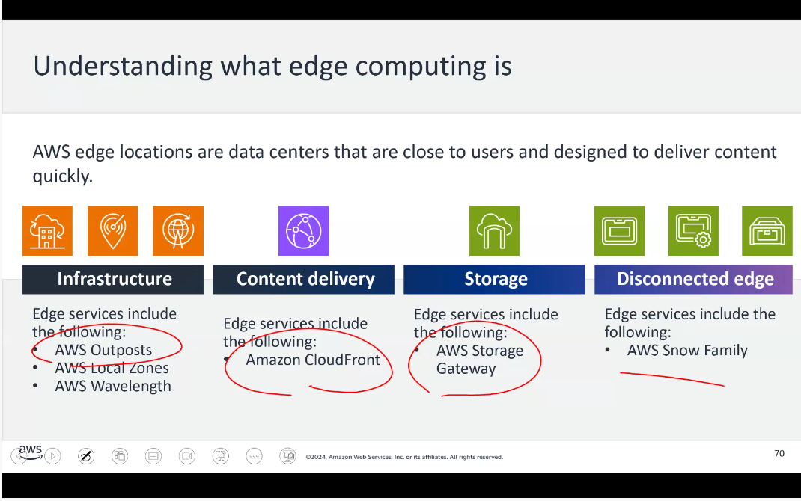

#### Infrastructure Edge Services

1.  **AWS Outposts** -- (Zonal service) Brings fully managed AWS compute and storage to on-premises locations. Ideal for workloads needing low latency or local data processing.
2.  **AWS Local Zones** -- Extends Regions closer to users
3.  **AWS Wavelength** -- Embeds compute within 5G networks for mobile edge computing

#### Content Delivery Edge Services

**Amazon CloudFront** -- (Global/Edge service) AWS's CDN that speeds up web content by delivering it from servers close to users. Caches content at global edge locations, reducing latency.

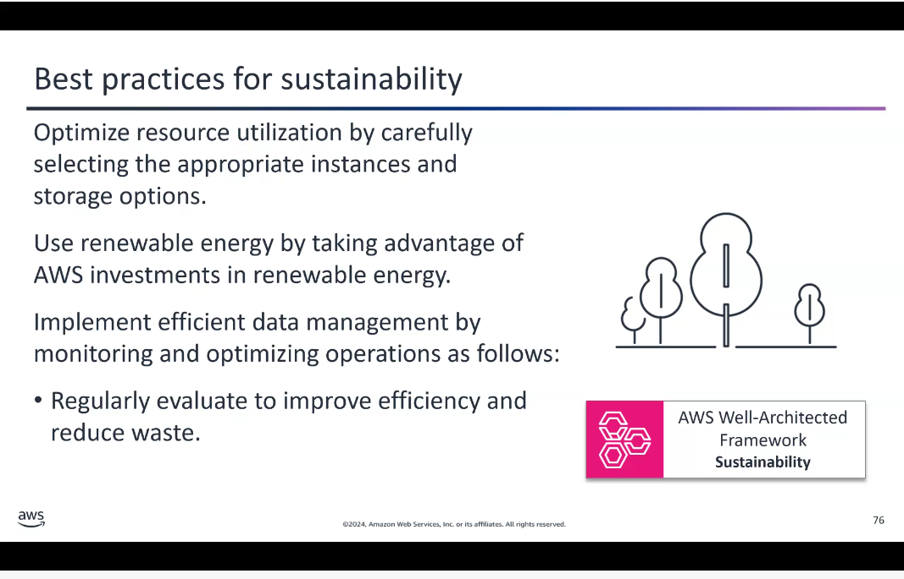

### Topic F: Protecting Against Web-Based Attacks

1.  **AWS WAF** -- Protects web applications from SQL injection, XSS, and other attacks using user-defined rules
2.  **AWS Shield** -- Managed DDoS protection
    - **Shield Standard** -- Free, automatic protection against common DDoS attacks
    - **Shield Advanced** -- Paid, enhanced protection with detailed diagnostics
3.  **AWS Inspector** -- Automated security assessment to identify vulnerabilities
4.  **AWS Security Hub** -- Central hub that aggregates security alerts from multiple AWS services
5.  **Amazon GuardDuty** -- Threat-detection service that continuously monitors for malicious activity

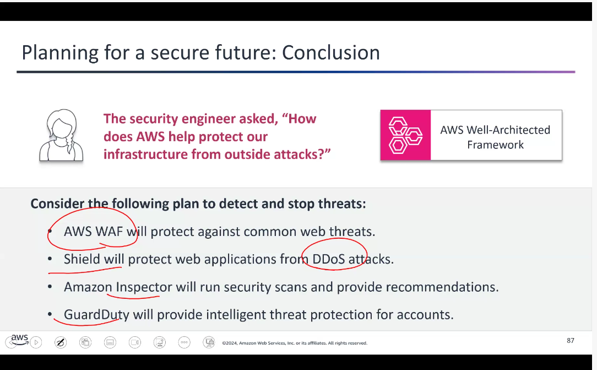

------------------------------------------------------------------------
