So here's the deal -- I got tired of paying subscriptions for Google One, iCloud, and all the other "we own your data, pay us rent" services. My goal? Build my own private cloud at home. Self-host, baby. Stick it to Big Tech. Save some money. Also, flex when friends come over: *"Yeah, that's my server. No big deal."*

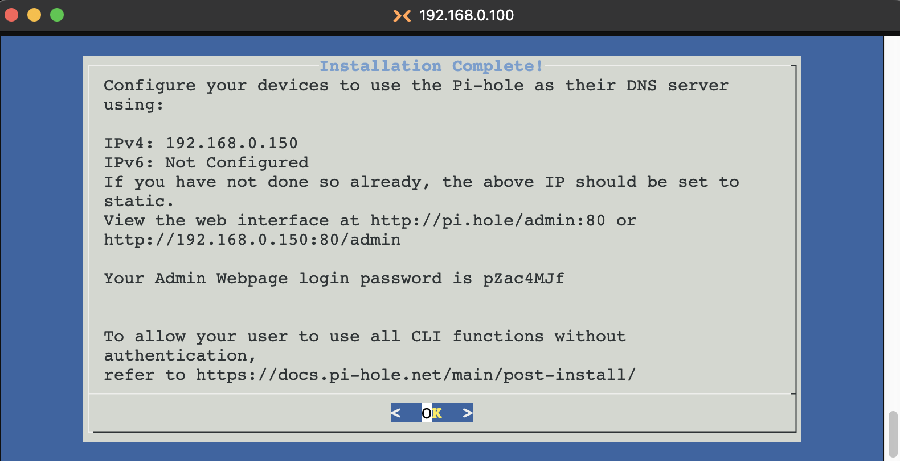

## The Dream Setup

In my head, this was simple. Grab a Raspberry Pi 5 (8GB RAM), hook up a couple of drives, sync my phone, PC, Mac, toaster -- whatever -- and boom: personal cloud.

Final requirements looked like this:

1.  Sync phone media across devices (iPhone, Android, PC, Mac, fridge if possible)
2.  Have backups off-site (RAID 1 or JBOD mode)
3.  Access data from anywhere in the world via VPN

## Hardware Recommendations (What I Researched)

**Get a Raspberry Pi 5 (8GB RAM)** -- The extra RAM will be crucial for this use case, and USB 3.0 ports will significantly improve drive performance. The Pi 4 8GB is also acceptable if you find a better deal.

**Critical addition needed:** You'll want a powered USB hub or dual-drive enclosure. Running two 2TB drives directly from Pi USB ports will likely cause power issues and instability.

### Software Stack Options

I looked into a few different approaches:

**Option 1: OpenMediaVault + Docker**

- **Base OS:** OpenMediaVault 7 (Debian-based, Pi-optimized)
- **Storage:** JBOD setup (4TB usable) with backup strategy
- **Services via Docker:** Nextcloud, Syncthing, PhotoPrism
- **VPN:** WireGuard built into OMV

**Option 2: TrueNAS Scale Direct**

- More resource-heavy but very polished
- Built-in apps for Nextcloud, etc.
- Better web interface

### Storage Strategy (Cost-Optimized)

Instead of RAID 1, consider:

1.  **Drive 1:** Live data (2TB)
2.  **Drive 2:** Local backup (2TB)
3.  **Cloud backup:** Critical files only to a cheap service like Backblaze B2 (~\$1/month for 100GB)

This gives you 2TB usable vs 2TB with RAID 1, plus offsite backup.

### Sync Solutions

- **Photos/Videos:** PhotoPrism + Syncthing auto-upload
- **Files:** Nextcloud for cross-platform sync
- **Large media:** Direct Syncthing (faster than Nextcloud for big files)

## The Broke Student Reality Check

Then reality hits. Raspberry Pis cost like \$60–90. For context, that's basically my weekly food budget. Hard drives aren't exactly raining from the sky either.

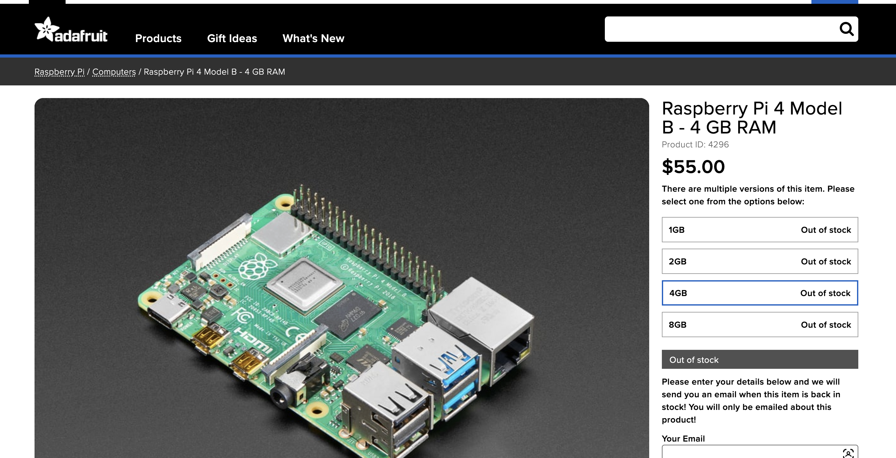

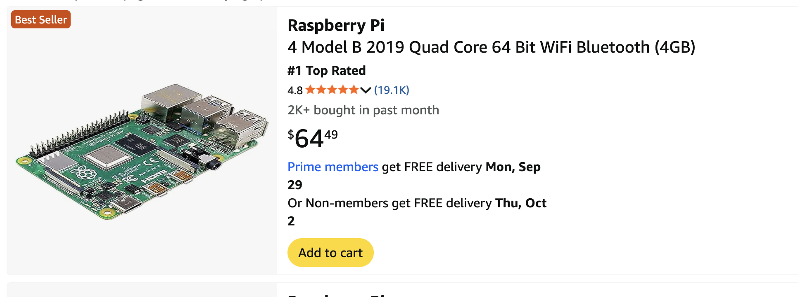

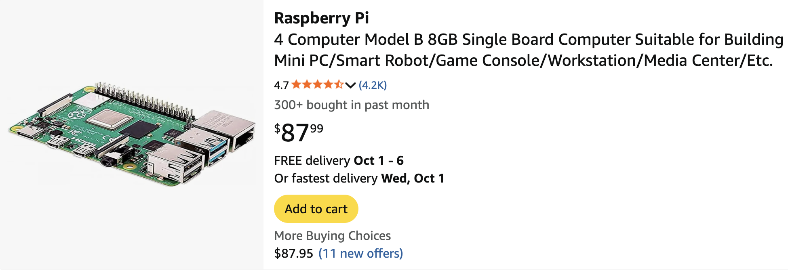

I even considered an RPi Zero 2W, but Reddit folks were like: *"lol bro, good luck running that with 512MB RAM. Might as well try hosting your cloud on a potato."*

So the thing -- I'm a student, and like most students -- broke. There's no way I'm spending 60-90 bucks on a raspberry pi, considering I'd have to get a couple of hard drives too (which aren't very cheap by my standards anyway).

Enter: **Hitesh**. My undergrad buddy who always tinkered with gadgets. He told me to forget Pis and start looking at used mini-PCs like Intel NUCs or Dell Optiplexes. Basically: "Stop being cute, get real hardware."

## The Hunt for Cheap Hardware

So I go hunting on eBay like a raccoon digging through tech trash. Intel NUCs? Too expensive. Dell Optiplexes? Decent, but still kinda pricey.

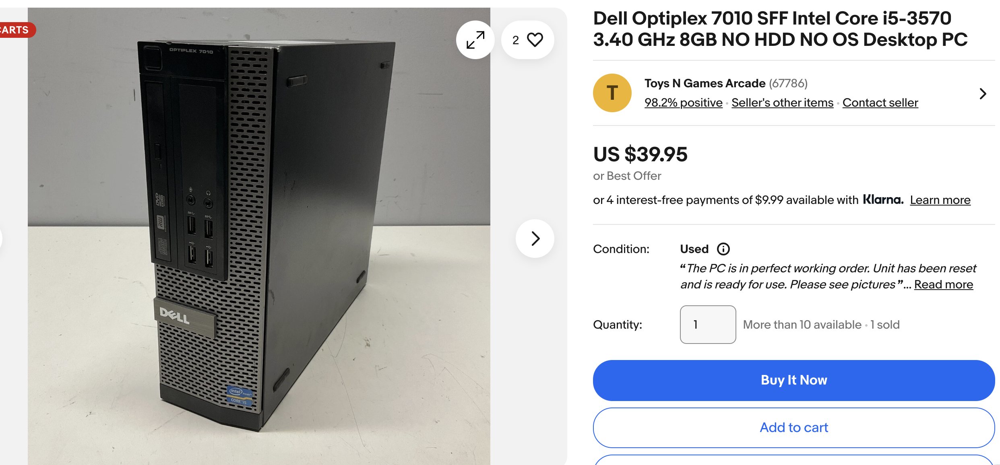

Good price, no HDD.

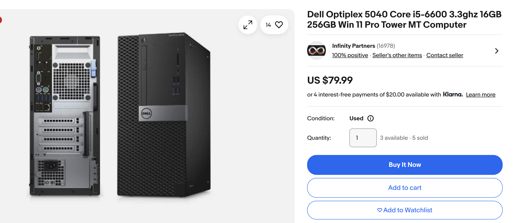

Decent specs, out of budget.

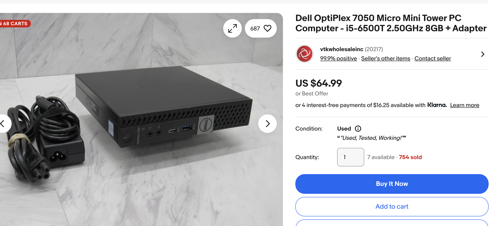

Decent specs, a bit out of budget -- but getting there.

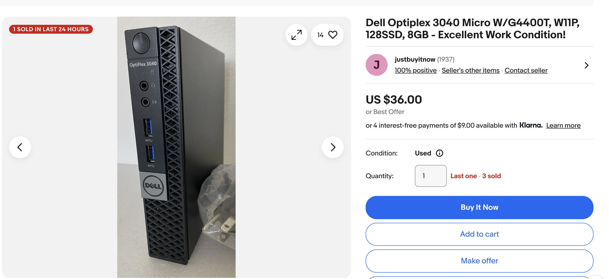

This is the one I had settled on. Total was exactly \$50 including shipping.

After days of scrolling through "refurbished" listings from sellers with usernames like *TechLord420*, I was about to give up. Then it happened.

A friend from Hopkins casually drops: *"Oh yeah, I've got a couple old PCs lying around, wanna buy one?"*

Excuse me? I talk to this guy almost every day and he waits until *now* to mention he's hoarding old hardware like a dragon?

I TALK TO THIS GUY ALMOST EVERYDAY, AND I DIDN'T THINK ABOUT MENTIONING THIS TO HIM BEFORE? Don't be like me. Don't be stupid.

Anyway, long story short: he says he picked up some old PCs in a clearance sale at our university's tech store. AND HE'S WILLING TO SELL IT TO ME AT THE ORIGINAL PRICE. WHICH IS \$25.

I figured I couldn't get a better deal than that, so I begged him to sell me one even though I didn't have to (Thank you Shaiv, I'm very grateful).

Turns out, this old PC he's talking about -- is a Dell Optiplex 5060 8GB+256GB. GG's. Jackpot.

## The Plan Evolves

It took about 2 days for the PC to spawn into my hands. I could see my dream turning into reality. In the meantime, I was reading up on stuff I could do with homelabbing equipment, and I came across something called **Pi-hole** -- a network wide software adblocker which operates as a DNS sinkhole, intercepting DNS requests and blocking those to known ad servers, trackers, or malicious domains before they can reach devices on the network. Good stuff. This is something I want as well.

Which led me to **Proxmox** -- a hypervisor that would let me run TrueNAS Scale in a VM + Pi-hole in a separate Linux container (LXC).

So we're officially moving away from doing just a TrueNAS Scale installation. Great.

Suddenly the plan wasn't just "install TrueNAS." Nope. Now it was:

- Run Proxmox as the hypervisor
- Spin up TrueNAS Scale in a VM
- Run Pi-hole in an LXC container
- Pretend I know what I'm doing

## Networking Hell

All of this is still fine. I've acquired the hardware. I just need to set everything up now. Seems pretty simple considering there's lots of resources online, right? Nah.

### Network Architecture

I live in a rented apartment. ISP is **Dojo Networks** -- people who decided to have a managed network for the whole building -- multiple apartments connecting over wifi to the same router -- WHICH WE DON'T HAVE ACCESS TO.

All this time, I didn't realize that building a server would require me to have a wired connection, and I can't rely on wifi to run my server. My Dell Optiplex 5060 SFF didn't come with a built-in wifi NIC -- only an ethernet NIC.

I found an ethernet port in my apartment and connected it to a friend's laptop (which had an ethernet port) to get the IPv4 address of the LAN:

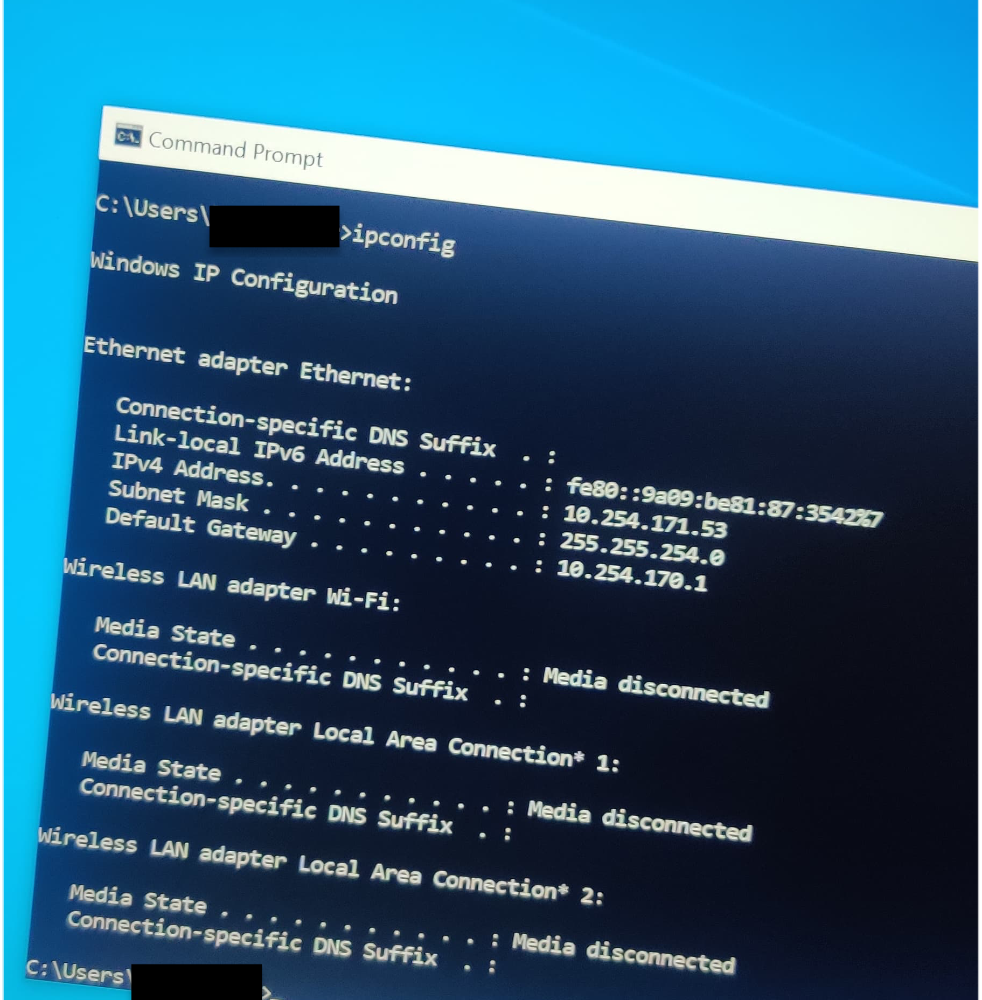

- **IPv4 address of LAN:** `10.254.171.53/23`
- **IPv4 address of WLAN:** `172.161.77.88/24`

So Dojo Networks has different IP subnets for its wireless and wired subnets. In a residential building. Bummer.

### Bridging the Networks

I need a way to bridge these networks so that devices on both can talk to each other. I looked around, and narrowed down my options:

1.  **Let all devices on 172.x.x.x VPN into 10.x.x.x + allow port forwarding** -- Since I don't have access to the router, there's no way for me to setup port forwarding here. This option won't work.
2.  **Buy a WiFi NIC + add it to my Dell Optiplex** -\> have it connect to the wifi -\> bridge the two physical NICs by modifying `/etc/network/interfaces`.
3.  **Buy a router** -\> have all my devices + server on the same network (devices wirelessly and server wired) by letting the server act as an AP for my devices.

I could've just bought a router and all these problems would've gone away. But, I went with option 2, because *I want to learn* how to do this stuff.

### WiFi NIC Installation

After looking around for cheap wifi cards + people who have had the same/similar problem, I landed on this:

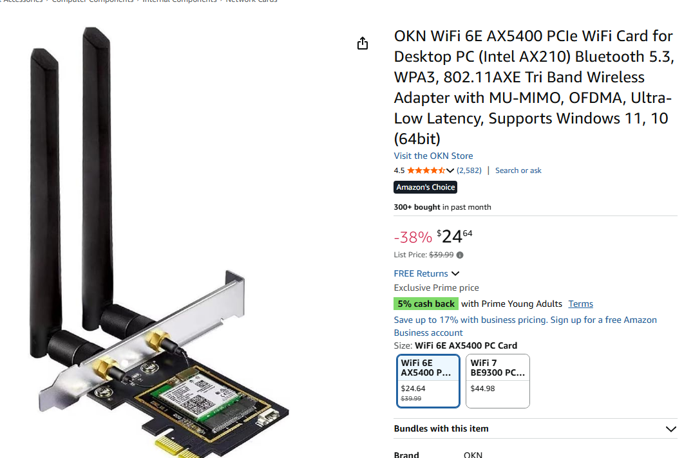

Bought it, put it into my Optiplex.

`ip a` output:

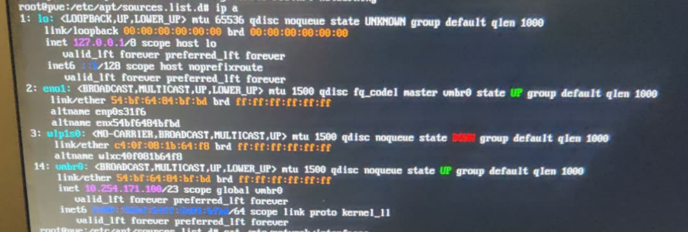

My current network topology looks like:

- Residential LAN port -\> Server LAN port
- Server PC also has a WiFi NIC -\> connects wirelessly to residential wifi router
- Server ethernet NIC and WiFi NIC are bridged by editing `/etc/network/interfaces`

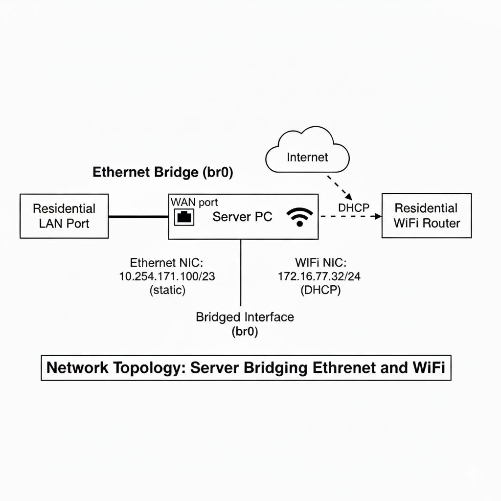

### Network Configuration

Things I did to achieve this -- modified `/etc/network/interfaces`:

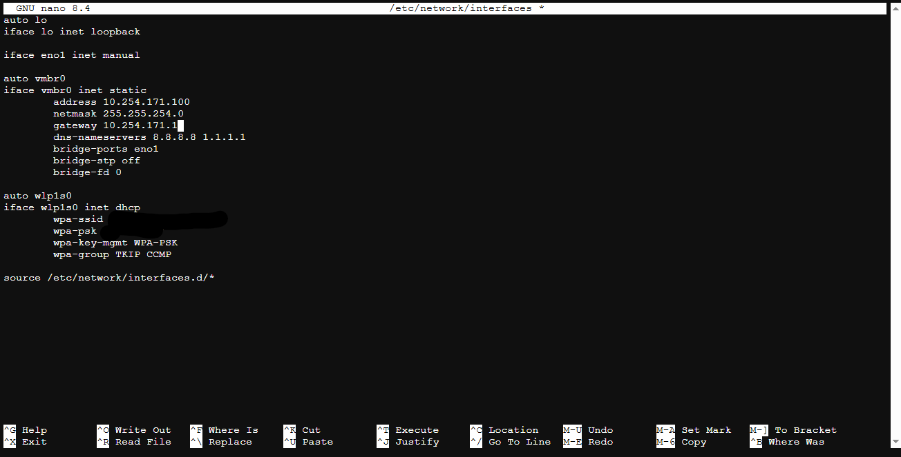

However, when I run `apt install <package name>` or `apt update`, I was constantly running into issues. I can't exactly remember in which order I resolved all of the errors (see screenshots below), because being the dumbass I am, I didn't think about documentation in the moment. So I compiled a list of screenshots of all the errors I ran into, and any changes I've made to files:

**Errors I ran into:**

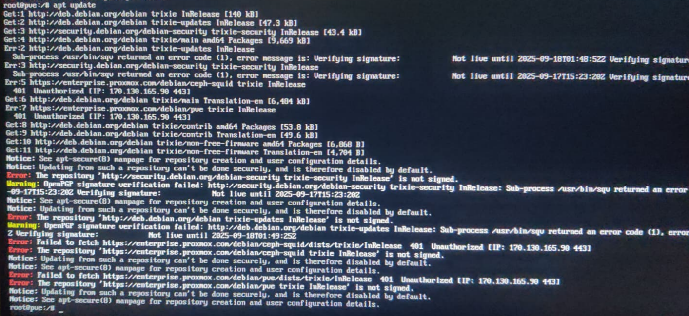

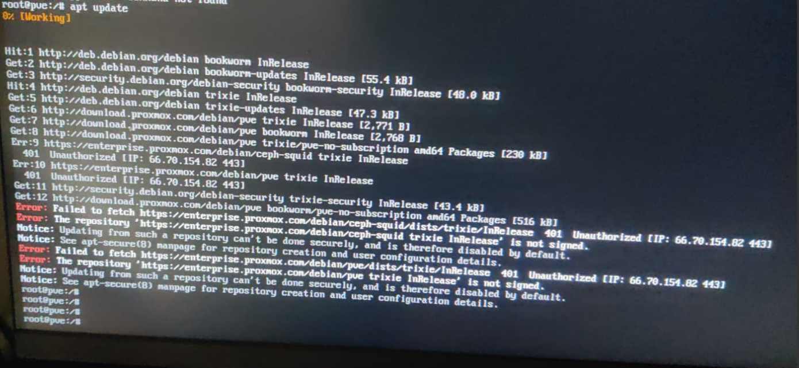

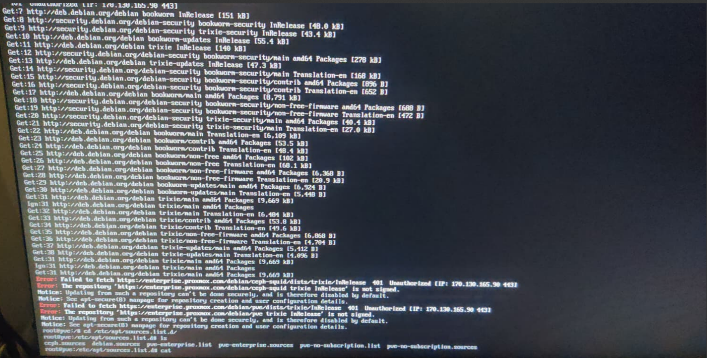

However, after doing all that, I still ran into problems while trying to turn the wlp1s0 interface up using `ifup wlp1s0`:

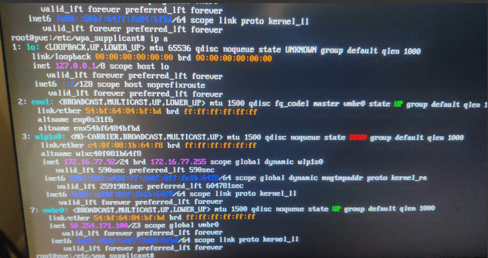

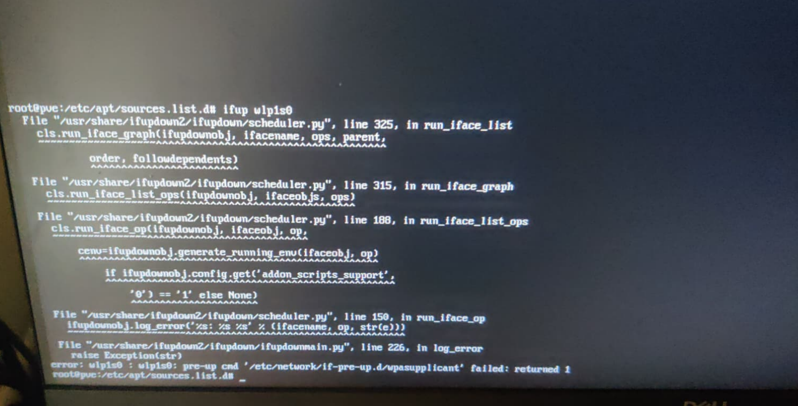

**Diagnosis:**

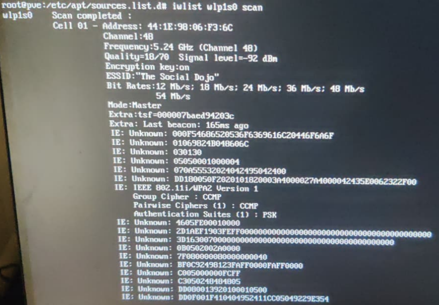

**Additional troubleshooting:**

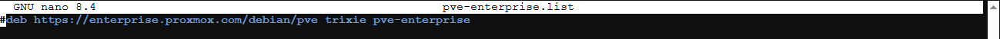

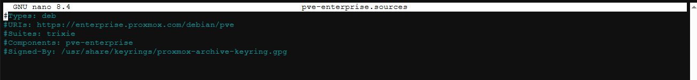

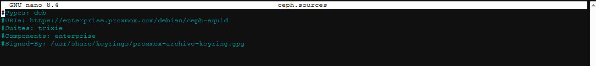

Added configuration:

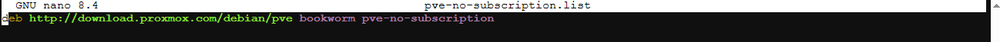

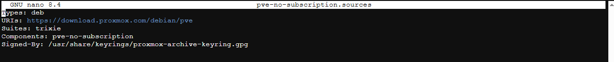

## Installing TrueNAS in a Proxmox VM

### Attaching HDDs to Proxmox

Reference: [YouTube Tutorial](https://www.youtube.com/watch?v=MkK-9_-2oko)

Used `lsblk` commands to get serial numbers of HDDs:

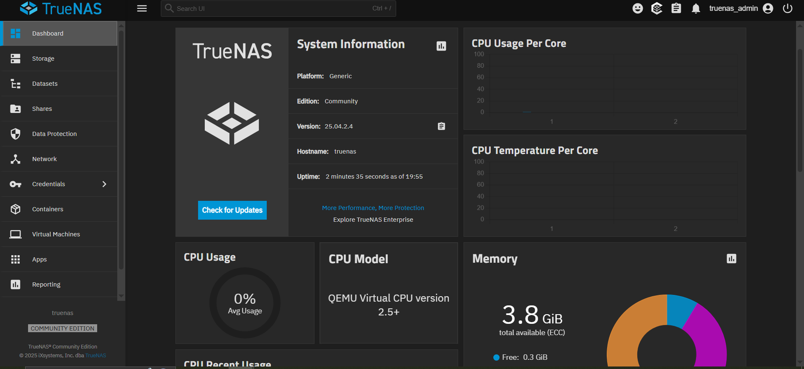

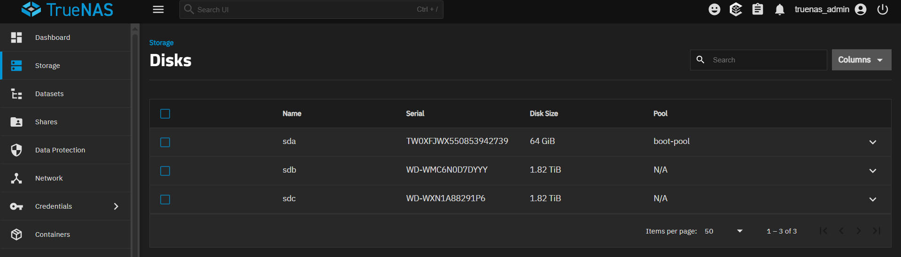

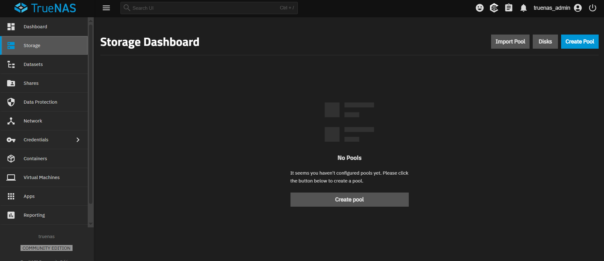

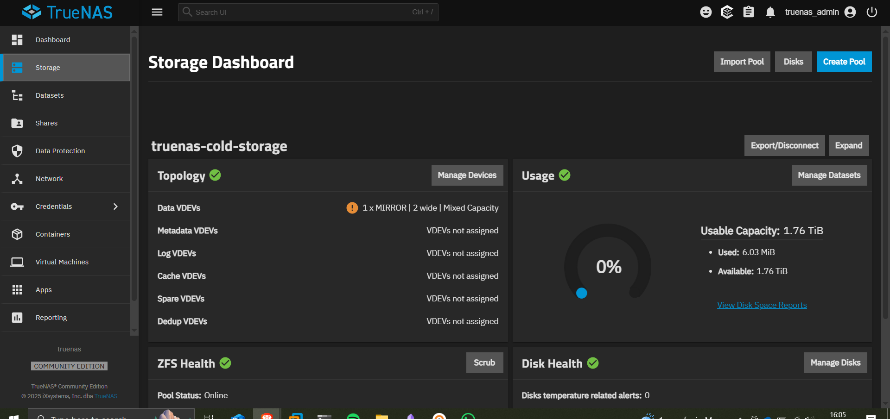

### Making Cold-Storage Accessible Over the Network

Adding a dataset:

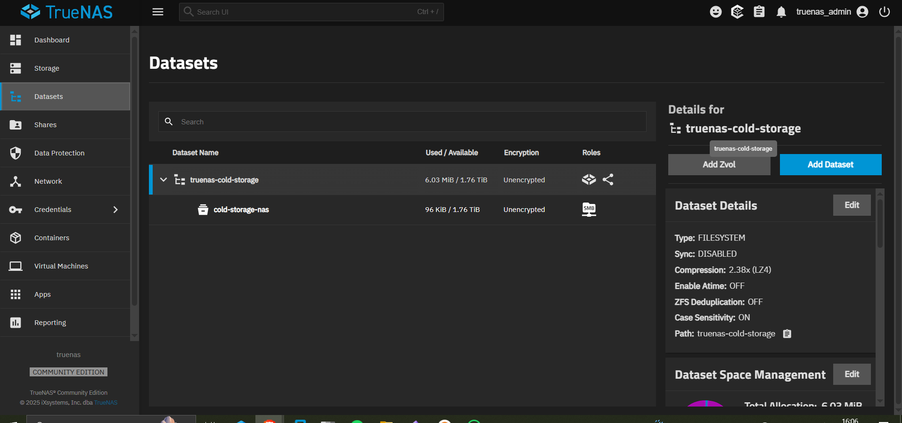

- Sync is disabled
- Record size is the recommended option -- works well for most use cases -- 128K
- Share is SMB

### Connecting to the SMB Share

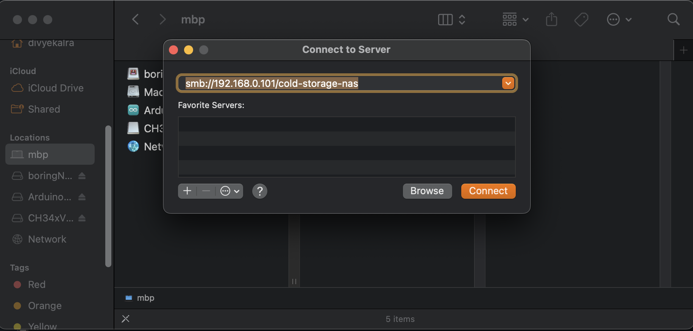

To add a TrueNAS SMB share to macOS Finder:

1.  First ensure the SMB share is configured on TrueNAS
2.  Go to **Finder \> Go \> Connect to Server** on your Mac
3.  Enter `smb://Your_TrueNAS_IP/Your_Share_Name`
4.  You will be prompted for the TrueNAS user credentials you created
5.  This will mount the share as a folder in the Finder sidebar

I entered my credentials and boom -- network storage accessible from my Mac.

## Pi-hole Setup in an LXC

What are LXCs? Linux Containers -- lightweight virtualization that shares the host kernel. Much more efficient than full VMs for simple services like Pi-hole.

Reference: [LXC Tutorial](https://www.youtube.com/watch?v=YaCjY5KTa-s)

## Tailscale VPN into My Home Network

Setting up Tailscale to access my home network from anywhere in the world.

Using Proxmox (192.168.0.100) as a subnet router: [Tailscale Subnet Routers](https://tailscale.com/kb/1019/subnets)

This lets me VPN into my home network and access all my self-hosted services from my phone, laptop, wherever I am. Pretty slick.

## Configuring SSH on a Proxmox Ubuntu VM

Basic SSH setup commands:

    sudo apt install openssh-server -y
    sudo systemctl status ssh
    sudo systemctl enable ssh
    sudo ufw allow ssh
    sudo ufw enable

SSH into the VM:

    ssh username@server-ip-address

## Useful Resources

Some links I found helpful during this journey:

- [FreeBSD ZFS Handbook](https://docs.freebsd.org/en/books/handbook/zfs/) -- Understanding ZFS
- [Building a \$200 Home Server (YouTube)](https://www.youtube.com/watch?v=A1JjOVj9XEg)
- [Adding More HDDs to a Motherboard](https://www.reddit.com/r/HomeServer/comments/1b889kj/)
- [Best Mini PC Under \$100](https://www.reddit.com/r/MiniPCs/comments/18wugqq/)
- [Automated Plex Server with Real-Debrid](https://www.reddit.com/r/RealDebrid/comments/1iqfnzm/)

## Additional Topics to Explore

- [Logical Structure of Hard Disk Drives](https://wiki.preterhuman.net/The_Logical_Structure,_Organization,_and_Management_of_Hard_Disk_Drives)
- Static IP assignment on networks: [SuperUser Discussion](https://superuser.com/questions/1615438/)

## Conclusion (aka: What Have I Done?)

So in the end, I went from *"gonna buy a Raspberry Pi"* to *"running Proxmox on a dusty Dell Optiplex I got for the price of a Chipotle burrito."*

Is my home cloud running perfectly yet? Getting there. Is it at least alive? Hell yeah.

Current setup:

- **Hardware:** Dell Optiplex 5060 SFF (8GB RAM, 256GB SSD) + WiFi NIC
- **Hypervisor:** Proxmox VE
- **Storage VM:** TrueNAS Scale with attached HDDs
- **Services:** Pi-hole (LXC), SMB shares
- **Remote Access:** Tailscale VPN

But hey, that's homelabbing for you: equal parts tech, chaos, and existential dread.

**Pro tip:** Before you spend hours searching eBay, maybe ask your friends if they have old hardware collecting dust. You might save money *and* a friendship.
